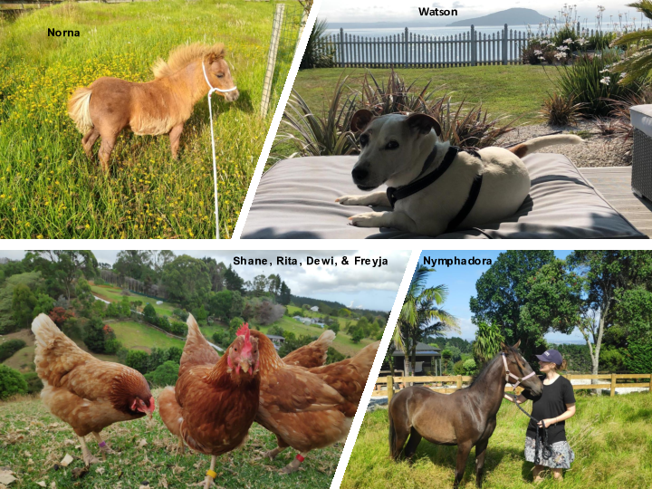

<style type="text/css">
slides > slide:not(.nobackground):after {
  content: '';
}
</style>

```{r setup, include=FALSE}
knitr::opts_chunk$set(echo = FALSE)
```

## 



## 


<ul style="font-family: bookman, bookman; font-size:30pt; top:40%;position: absolute;">
  c.jonestodd@auckland.ac.nz
 </ul>

## 


<ul style="font-family: bookman, bookman; font-size:50pt; top:40%;position: absolute;">
  bit.ly/statbiscuits
 </ul>


##
<ul style="font-family: bookman, bookman; font-size:30pt; top:25%;position: absolute;">
  <li> Experimental design</li>
  <li> Multivariate analysis</li>
  <li> Hypothesis testing</li>
  <li> Introduction to linear modelling</li>
  <li> Modelling II</li>
 </ul>

## 

<ul style="font-family: bookman, bookman; font-size:50pt; top:40%;position: absolute;">
  bit.ly/statbiscuits
 </ul>