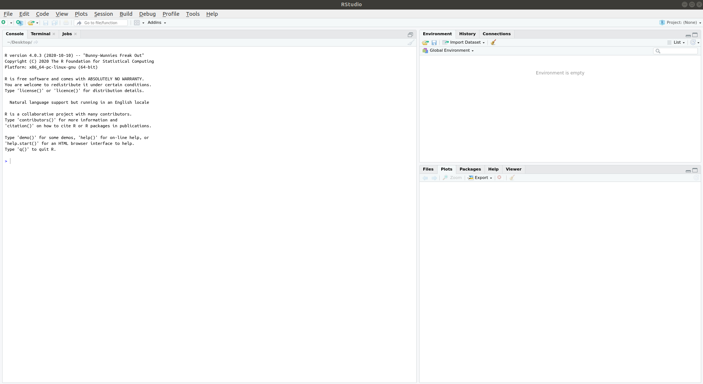

#  `R` and `RStudio`

The purpose of this chapter is to get you started learning a new language! Throughout BIOSCI220 you will be introduced to tools required to critically analyse and interpret biological data, and processing into biological information.

Following each step of this chapter carefully you are expected to install `R` and `RStudio` onto your computers as each week you will be expected to carry out a little programming! If you don't have your own computers then there are, of course, lab computers available that already have `R` and `RStudio` installed. If you choose to use these then you should still complete the excersises below to familiarise yourself with the software. Anither option available is the use of [RStudio Cloud](https://rstudio.cloud/); here, everything is run in a web browser (on a remote server) and doesn't require you to download the software onto your persnal computer. As a student at the University of Auckland you will already have an account associated with your UPI. 

## Learning Objectives

+ Define the difference between `R` and `RStudio`
    + Express the benefits and issues associated with these software being used in the scientific community. Specifically,
       + summarize the benefits and drabacks associated with the open-source paragdim,
       + discuss the concept of reproducible research and outline its importance
+ Distinguish between different data types (e.g., integers, characters, binary, numerical)
+ Explain what an `R` function is; describe what an argument to an `R` function is
+ Explain what an `R` package is; distinguish between the functions `install.packages()` and `library()`
+ Use the appropriate `R` function to read in a `.csv` data; carry out basic exploratory data analysis and simple plotting procedures using `tidyverse` 


## Introduction to `R` and `RStudio`?


`R` is the pheromone to `RStudio`'s PDA.


`R` is a languange. Specifically a programming language; it's the way you can speak to your computer to ask it to carry out certain computations.

`RStudio` is an integrated development environment (IDE). This means it is basically an interface, albeit a fancy one, that makes it easier to communicate with your computer in the `R` language. The main benefit is the additional features it has that enable you to more efficiently *speak* `R`.

**Note** `R` and `RStudio` are two **different** pieces of software; for this course you are expected to download both. As you'd expect the PDA depends on the pheramones (i.e., `RStudio` depends on `R`) so you have to download `R` to use `RStudio`! 

### Why?

The selling pitch of this course states that *...biological research has actually been heavily quantitative for 100+ years...* and promises that *...it is now essential for biology students to acquire skills in working with and visualising data, learning from data using models...*. We're not making it up! If you need convincing that quantitative and programming skills are essential to graduate in **all** scientific disiplines have a read of the following.

+ [The Popularity of Data Science Software](http://r4stats.com/articles/popularity/)
+ [Why R?](https://datacarpentry.org/semester-biology/about/why-r/)


#### Why`R`?

+ It's free
+ It's [open source](https://opensource.com/resources/what-open-source)
  + There are no guarantees
  + But it's always under scrutiny
  + robust
+ It's available for all operating systems (Windows, Linux, and Mac)
+ There is a huge online support network
+ It's extremely flexible; if you can code it you can do it!
+ It facititates [reproducibility](https://en.wikipedia.org/wiki/Reproducibility)

#### Why `RStudio`?

+ Speaks nicely to `R`
+ There is a huge online support network
+ Offers many other features and tools to make your workflow with `R` easier

### Installing `R` and `RStudio`

As mentioned above `RStudio` depends on `R` so there is an order you should follow when you download these software.

 1. **Download and install `R`** by following [these instructions](https://cloud.r-project.org/). Make sure you choose the correct operating system; if you are unsure then please ask either a TA or myself.
 
 2. **Download and install `RStudio`** by [going here](https://rstudio.com/products/rstudio/download/) choosing RStudio Desktop *Open Source License* **Free** and following instructions. Again if you are unsure then please ask either a TA or myself.

 3. **Check all is working**
    + Open up `RStudio` from your computer menu, the icon will look something like this {width=7%} (**DO NOT** use this icon  {width=4%}, this is a link to `R` and will only open a very basic interface)
    + Wait a little and you should see `RStudio` open up to something similar to the screenshot below
    
    + Pay close attention to the notes in the screenshot and familiarise yourself with the terms.
    + Finally, in the *Console* next to the prompt type **1:10** and press enter on your keyboard. Your computer should say something back you (in the *Console*)! What do you think you were asking it to do? Does the output make sense?^[You should have seen the numbers 1 to 10 printed out as a sequence.]

If you get stuck at any of the steps above then please ask either a TA or myself. It is imperitive for the rest of the course that you complete the steps above.
   


### Getting started

As in step 3. above  open up `RStudio` from your computer menu, the icon will look something like this {width=7%}. Using the diagram above identif the different panes:

 + *Console* where you directly type command in and communicate with your computer (via the languge `R`).
 + *Environment pane*
 + *Files pane*

Some terminology

+ *Running* code: the act of telling R to perform an act by giving it commands in the console.
+ *Objects*: where values are saved in  (see later for vreating an *object*.
+ *Script*: a text file containing a set of commands and comments.
+ *Comments*: notes written within a *Script* to better document/explain what's happening

### R *Script*s (a `.r` file)

Go **File** > **New File** > **R Script** to open up a new *Script*

A new (fourth) pane should open up in the top left of `RStudio`, your *Console* will have shrunk in size to accomodate this extra pane. This file will have a `.r` extension and is where you can write, edit, and save the `R` commands you write. It's a dedicated test editor for your `R` code (very useful if you want to save your code to run at a later date). The main difference between typing your code into a *Script* vs *Console* is that you edit it and save it for later! Remember though the *Console* is the pane where you communicate with your computer so all code you write will have to be *Run* here. There are two ways of *running* a line of code you've written in your *Script*

 + Ensure your cursor is on the line of code you want to run, hold down **Ctrl** and press **Enter**.
 + Ensure your cursor is on the line of code you want to run, then use your mouse to click the Run button (it has a green arrow next to it) on the top right of the *Script* pane.

Type *1:10* in your *Script* and practise *running* this line of code using both methods above. Not that if you've *Run* the code succesfully then your computer will speak back to you each time via the *Console*

### Writing *Comments*

*Comments* are notes to yourself (future or present) or to someone else that are, typically, written interdisperesed in your code. Now, the comments you write will typically be in a lanugage your computer doesn't understand (e.g., English). So that you can write yourself notes in your *Script* you need to tell your computer using the `R` language to ignore them. To do this precede any note you write with \#, see below. The \# is `R` for "ignore anything after this character".

Now remember when you want to leave your `R` Session you'll need to **Save** your *Script* to use it again. To do this go **File** > **Save As** and name your file what you wish (remember too to choose a relevant folder on your computer!).

### Creating *Objects*

### Data types

Data types: integers, doubles/numerics, logicals, and characters. Integers are values like -1, 0, 2, 4092. Doubles or numerics are a larger set of values containing both the integers but also fractions and decimal values like -24.932 and 0.8. Logicals are either TRUE or FALSE while characters are text such as “cabbage”, “Hamilton”, “The Wire is the greatest TV show ever”, and “This ramen is delicious.” Note that characters are often denoted with the quotation marks around them.

Vectors: a series of values. These are created using the c() function, where c() stands for “combine” or “concatenate.” For example, c(6, 11, 13, 31, 90, 92) creates a six element series of positive integer values .
Factors: categorical data are commonly represented in R as factors. Categorical data can also be represented as strings. We’ll study this difference as we progress through the book.

### `R` functions

Functions (or command) perform tasks in R. They take in inputs called arguments and return outputs. You can either manually specify a function’s arguments or use the function’s default values.For example, the function seq() in R generates a sequence of numbers. If you just run seq() it will return the value 1. That doesn’t seem very useful! This is because the default arguments are set as seq(from = 1, to = 1). Thus, if you don’t pass in different values for from and to to change this behavior, R just assumes all you want is the number 1. You can change the argument values by updating the values after the = sign. If we try out seq(from = 2, to = 5) we get the result 2 3 4 5 that we might expect.

### `R` packages


The base installation of R comes with many useful packages as standard. These packages will contain many of the functions you will use on a daily basis. However, as you start using R for more diverse projects (and as your own use of R evolves) you will find that there comes a time when you will need to extend R’s capabilities. Happily, many thousands of R users have developed useful code and shared this code as installable packages. You can think of a package as a collection of functions, data and help files collated into a well defined standard structure which you can download and install in R.

To install a package from CRAN you can use the install.packages() function. For example if you want to install the remotes package enter the following code into the Console window of RStudio (note: you will need a working internet connection to do this)


CRAN is like a centralised library with thousands of books in stock. 

To access the contents of a book (package) you first need to request it for (install it into)  your local library (your computer)


Your can only access books in your local library.


```{r, eval = FALSE, echo = TRUE}
install.packages('the.package.name')
```


To access the knowledge in a particular book (use the function is the package) you need to tell your computer via `R` to go get the book of the shelf. Then you have access to all the functions it contains!

```{r, eval = FALSE, echo = TRUE}
library(the.package.name)
```

### `R` Errors

Sometimes rather than doing what you expect it to your computer will return an Error message to you via the *Console* prefaced with **Error in...* followed by text that will try to explain what went wrong. This, genrally, means something has gone wrong, so what do you do?

 + Read it! THE MESSAGES ARE WRTTEN IN AS PLAIN A ENGLISH AS POSSIBLE
 + **DO NOT** continue running bits of code hoping the issue will go away. IT WILL NOT.
 + Try and work out what it means and fix it

Sometimes your computer will return a warning messages to you prefaced "Warning:". These can sometimes be ignored as they may not affect us. However, READ THE MESSAGE and decide for yourself. Occasionally, also your computer will write you a friendly message, just keping you up-to date with what it's doing, again don't ignore these they might be telling you something useful!


## Exploaratory Data Analysis (EDA)


To finish off this section and to ensure you're all set to go for the rest of the module we're going to carry out some exploratory data analysis and vizualisations on some real-world data :-)

For this module we will be using `tidyverse`. ['tidyverse'](https://www.tidyverse.org/) is a colletion of `R` packages that all share underlying design philosophy, grammar, and data structures. They are specifically designed to make data wrangling, manipulation, vizualisation, and analysis simpler.

To install **all** the pakckages that belong to the `tidyverse` run

```{r, echo = TRUE, eval = FALSE}
install.packages("tidyverse")

```

To tell your computer to access the `tidyverse` functionality in your session run (**Note** you'll have to do this each time you start up an `R` session)

```{r, echo = TRUE, eval = FALSE}
library("tidyverse")

```

### Reading in data from a `.csv` file

First off download this `.csv` fle onto your computer (remember which folder you saved it in!)

### Using simple commands to explore the data

Ask and answer interesting questions about data


### Basic plotting (for your own purposes)

The payoff is so clear: you make informative plots that help you understand data. 

### Plotting to make a point (for others to interpret)

## Other resources: optional but reading at least one is **recommended**

+ [R for Data Science](https://r4ds.had.co.nz/)
+ [RStudio Education](https://education.rstudio.com/learn/beginner/)
+ [An Introduction to R](https://intro2r.com/)
+ [Learning statistics with R: A tutorial for psychology students and other beginners](https://learningstatisticswithr.com/lsr-0.6.pdf)
+ [R for Biologists](https://www.rforbiologists.org/)