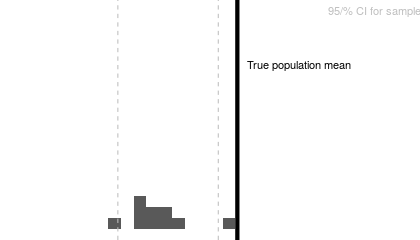
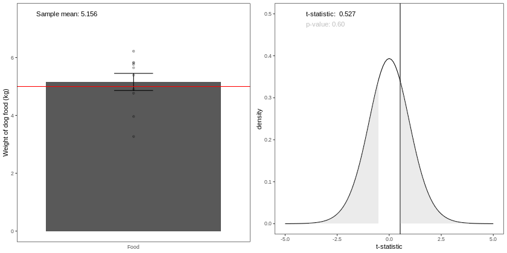
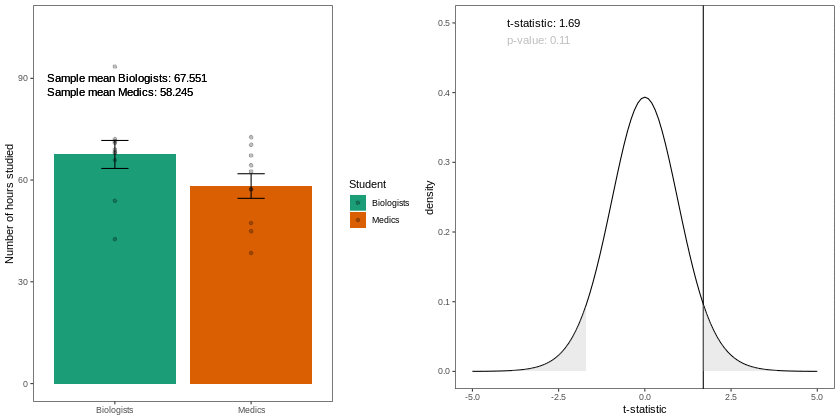
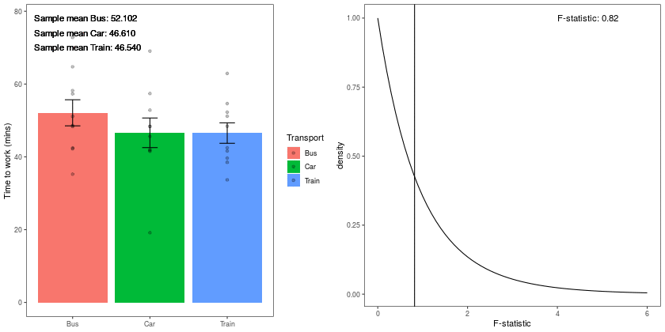
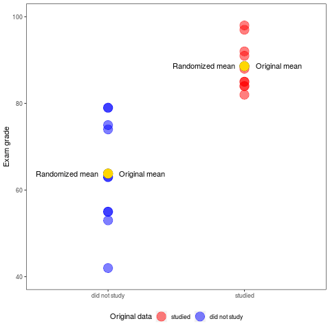

```{r setup, include=FALSE}
knitr::opts_chunk$set(echo = FALSE, eval = TRUE,message = FALSE, warning = FALSE)
library(dplyr)
library(ggplot2)
library(magick)
library(gganimate)
## devtools::install_github("thomasp85/transformr")
library(transformr)
```


## Learing Objectives

By the end of this lab students should be able to

   + List appropriate questions posed by the biological questions and outline an appropriate hypothesis test that would answer it
   + Describe the aims of the following hypothesis tests
      + one-sample t-test
      + two-sample t-test (independent and dependent)
      + randomization test
      + one-way Analysis of Variance (ANOVA)
  + List the aims of hypothesis testing and write out the appropriate null and alternative hypothesis using statistical notation
  + Write R code to carry out an hypothesis test using the appropriate variables in their dataset. Specifically write R code to carry out
     + one-sample t-test
     + two-sample t-test (independent and dependent)
     + randomization test
     + one-way Analysis of Variance (ANOVA)
  + Interpret and communicate the findings of an hypothesis test accurately and concisely
  + List the limitations of the hypothesis in relation to the questions posed by the data
  + State in terms of probability statements the meaning of the power and significance level of an hypothesis test
  


### Pre lab reading

[Sadler EA, Pitts JP, Wilson JS. 2018. Stinging wasps (Hymenoptera: Aculeata), which species have the longest sting? PeerJ 6:e4743 https://doi.org/10.7717/peerj.4743](https://peerj.com/articles/4743/)

### Suggested reading


<iframe src="https://tinystats.github.io/teacups-giraffes-and-statistics/" width="800" height="400" frameborder="0" marginheight="0" marginwidth="0">Loading…</iframe>

## Motivation


## Plausible range for a parameter---confidence intervals

A confidence interval can be thought of as a plausible range within which we might expect the true value of some unknown population parameter to lie. The level of “confidence” associated with this interval typically reflects the proportion of time we would expect an interval to contain the true value of the parameter. For example, if we took 100 samples, calculating the 95% confidence interval for the mean each time, we would expect the intervals to contain the “true” (population) mean 95 times.

```{r confidence,eval = FALSE}
set.seed(2020)
y <- rnorm(500,10,3)
N <- 100 ## number of times to resample
nanim <- 10 ## number of times for animation
Y <- data.frame(m = numeric(N*nanim), nani = rep(1:N, each = nanim))
for(i in 1:(N*nanim)){
  Y$m[i] <- mean(sample(y,length(y), replace = TRUE))
}
quants <- matrix(NA, ncol = 2, nrow = nanim)
for(i in 1:nanim){
  quants[i,] <- quantile(Y$m[Y$nani == i],probs = c(0.25,0.975))
}

sum_Y <- Y %>%
  group_by(nani) %>%
  summarize(means=mean(m),
            lwr = quantile(m, probs = 0.025),
            upr = quantile(m,probs = 0.975))


plt <- ggplot(Y, aes(m)) + geom_histogram() + theme_void() +
  geom_vline(xintercept = 10,size = 2) + 
  geom_vline(data = sum_Y,aes(xintercept = lwr),color = "grey", linetype = "dashed") +
  geom_vline(data = sum_Y,aes(xintercept = upr),color = "grey", linetype = "dashed") +
  annotate(x = 10.2,y = 15, label = "True population mean", geom = "text") + 
  annotate(x = 10.5,y = 20, label = "95/% CI for sample means", geom = "text",col = "grey") + 
    transition_states(states = nani,transition_length = 2,state_length = 1) 
  
gif <- animate(plt, width = 420, height = 240)

anim_save("../gifs/ci.gif",gif)
```




## Inference about a mean

### Calculating a 95\% confidence interval using the t-distribution

Using the standard error of an estimate we can calculate a 95% confidence interval (CI). For the population mean a 95% confidence interval can be calculated as $$\hat{\mu} \pm t_{97.5}se_\mu$$
where $\hat{\mu}$ is the sample mean, se_\mu is the standard error of the mean, and $t_{97.5}$ is the $t$-multiplier (the 97.5% quantile of the $t$-distribution). This multiplier is based on the confidence level desired and depends on the sample size. A standard error of some estimated parameter is a measure of accuracy of the estimate. The standard error of a mean, $se_\mu$ can be written as
$$se_\mu =\frac{\text{sd}}{\sqrt{n}}$$
where sd is the standard deviation of the sample and $n$ is the sample size.


### Am I being ripped off by the dog food company?

Claim: The company that supplies my dog food claim that each bag I buy is on average 5kg. To test this claim, over 6 months I weigh each bag of dog food I buy from that company.

Hypothesis: We test the Null hypothesis, $H_0$, that on average each bag contains 5kg of dog food versus the alternative hypothesis, $H_1$, that the average weight is **not equal** to 5kg

+ $H_0: \mu = 5$kg vs $H_1: \mu \neq 5$kg

Assumptions: 

  + Each bag is independent from the other 
  + Each datapoint (weight) come from the same distribution
  + The weights are Normally distributed
  
Test Statistic: t-statistic = $\frac{\bar{Y} - \mu}{se_\mu}$ = $\frac{\bar{Y} - 5}{se_\mu}$ =  $\frac{\bar{Y} - 5}{\sqrt{s^2/n}}$

 + Where $\bar{Y}$ is the sample mean, $s$ is the sample standard deviation, and $n$ is the number of observations


Propability of getting a t-statistic at least as extreme as the one we observe (think of the area under the tails of the curve  below).

```{r one-sample,fig.cap= "Gif inspired by [https://crumplab.github.io/statistics/gifs.html](https://crumplab.github.io/statistics/gifs.html)",eval = FALSE}
## simulate data
dog <- data.frame(type = "Food",weight = rnorm(100,5,1), reps = rep(1:10,each = 10))

means_df <- dog %>%
    group_by(reps,type) %>%
    summarize(means = mean(weight),f
              sem = sd(weight)/sqrt(length(weight)))

stats_df <- dog %>%
    group_by(reps) %>%
    summarize(ts = t.test(weight,mu = 5)$statistic)


a <- ggplot(means_df, aes(x = type, y = means)) +
    geom_bar(stat = "identity") +
    geom_point(aes(x = type, y = weight), data = dog, alpha = .25) +
    geom_errorbar(aes(ymin = means - sem, ymax = means + sem), width = .2) +
    theme(axis.title.x=element_blank(),
          axis.ticks.x=element_blank(),
          panel.background = element_blank(),
          panel.grid.minor = element_blank(),
          panel.grid.major = element_blank(),
          panel.border = element_rect(colour='black', fill=NA)) +
    geom_hline(yintercept = 5, col = "red") + 
    xlab("") + ylab("Weight of dog food (kg)") +
    transition_states(
        states = reps,
        transition_length = 2,
        state_length = 1) +
    geom_text(aes(0.5, 7.5,label = paste("Sample mean:", format(round(means, 3),nsmall = 2))),
              size = 4, hjust = 0, color = "black") +
    enter_fade() + 
    exit_shrink() +
    ease_aes('sine-in-out')
  
a_gif <- animate(a, width = 420, height = 420)

b <- ggplot(stats_df, aes(x = ts))+
  geom_vline(aes(xintercept = ts, frame = reps))+
  geom_line(aes(x=x,y=y),
            data = data.frame(x = seq(-5,5, .1),
                              y = dt(seq(-5,5, .1), df = 18))) +
    theme(panel.background = element_blank(),
          panel.grid.minor = element_blank(),
          panel.grid.major = element_blank(),
          panel.border = element_rect(colour='black', fill=NA)) +
  ylab("density") +
  xlab("t-statistic") +
  transition_states(
    states = reps,
    transition_length = 2,
    state_length = 1
  ) +
    geom_text(aes(-4, 0.5,label = paste("t-statistic:", format(round(ts, 3), nsmall = 2))),
              size = 4, hjust = 0, color = "black") +
  enter_fade() + 
  exit_shrink() +
  ease_aes('sine-in-out')

b_gif <- animate(b, width = 420, height = 420)

a_mgif <- image_read(a_gif)
b_mgif <- image_read(b_gif)

new_gif <- image_append(c(a_mgif[1], b_mgif[1]))
for(i in 2:100){
  combined <- image_append(c(a_mgif[i], b_mgif[i]))
  new_gif <- c(new_gif, combined)
}

anim_save("../gifs/os_ttest.gif",new_gif)


```





## Inference about two means

### Independent samples

Claim: Biologists and Medics study different numbers of hours to each other. To test this we could ask a sample of biology and medicine students

Hypothesis: We test the Null hypothesis, $H_0$, that on average Biology students study for the same number of hours (i.e., the difference, d, is zero) as medicine students verses the alternative hypothesis, $H_1$, that they don't!

+ $H_0: \mu_{\text{Biologists}} - \mu_{\text{Medics}} = d \rightarrow \mu_{\text{Biologists}} - \mu_{\text{Medics}} = 0 \rightarrow \mu_{\text{Biologists}} = \mu_{\text{Medics}}  $ vs $H_1: \mu_{\text{Biologists}} \neq \mu_{\text{Medics}}$

Assumptions: 

  + Each student is independent of the other
  + Each datapoint (number of hours studied) come from the same distribution
  + The number of hours studied are Normally distributed
  
Test Statistic: t-statistic = $\frac{(\bar{Y}_{\text{Biologists}} - \bar{Y}_{\text{Medics}}) - d}{\sqrt{(s_{\text{Biologists}}^2/n_{\text{Biologists}}) + (s_{\text{Medics}}^2/n_{\text{Medics}})}}$ 

  + Where $\bar{Y}_{\cdots}$ is the sample mean of either the Biologists or Medics, $s^2_{\cdots}$ is the sample standard deviation of either the Biologists or Medics, and $n_{\cdots}$ is the number of observations of either the Biologists or Medics


Propability of getting a t-statistic at least as extreme as the one we observe (think of the area under the tails of the curve below).


```{r independent t-test, fig.cap= "Gif inspired by [https://crumplab.github.io/statistics/gifs.html](https://crumplab.github.io/statistics/gifs.html)",eval=FALSE}
## independant t-test
## simulate data
A <-rnorm(100,50,10)
B <-rnorm(100,45,10)
DV <- c(A,B)
Student <- rep(c("Medics","Biologists"),each=100)
sims <- rep(rep(1:10,each=10),2)
df <- data.frame(sims, Student, DV)

means_df <- df %>%
               group_by(sims,Student) %>%
               summarize(means=mean(DV),
                         sem = sd(DV)/sqrt(length(DV)))
means_df$lab <- rep(1:2, times = 10)

stats_df <- df %>%
              group_by(sims) %>%
              summarize(ts = t.test(DV~Student,var.equal=TRUE)$statistic)

a <- ggplot(means_df, aes(x=Student,y=means, fill=Student))+
    geom_bar(stat="identity")+
    geom_point(data=df,aes(x=Student, y=DV), alpha=.25)+
    geom_errorbar(aes(ymin=means-sem, ymax=means+sem),width=.2) +
    ylab("Number of hours studied") +
    theme(axis.title.x=element_blank(),
          panel.background = element_blank(),
          panel.grid.minor = element_blank(),
          panel.grid.major = element_blank(),
          panel.border = element_rect(colour='black', fill=NA)) +
    transition_states(
        states = sims,
        transition_length = 2,
        state_length = 1
    ) +
    geom_text(aes(0.5, 80,label = paste("Sample mean Biologists:",
                                        format(round(means[c(sims[c(TRUE,TRUE,FALSE,FALSE)],
                                                             means_df$sims[c(TRUE,TRUE,FALSE,FALSE)] + 10)], 3),
                                               nsmall = 2))),
              size = 4, hjust = 0, color = "black") +
    geom_text(aes(0.5, 76,label = paste("Sample mean Medics:", format(round(means[sims*2], 3),
                                                                      nsmall = 2))),
              size = 4, hjust = 0, color = "black") +
    enter_fade() + 
    exit_shrink() +
    ease_aes('sine-in-out')

a_gif <- animate(a, width = 420, height = 420)

b <- ggplot(stats_df,aes(x=ts))+
    geom_vline(aes(xintercept=ts, frame=sims))+
    geom_line(data=data.frame(x=seq(-5,5,.1),
                              y=dt(seq(-5,5,.1),df=18)),
              aes(x=x,y=y)) +
    theme(panel.background = element_blank(),
          panel.grid.minor = element_blank(),
          panel.grid.major = element_blank(),
          panel.border = element_rect(colour='black', fill=NA)) +
    ylab("density")+
    xlab("t-statistic")+
    transition_states(
        states=sims,
        transition_length = 2,
        state_length = 1
    ) +
    geom_text(aes(-4, 0.5,label = paste("t-statistic:", format(round(ts, 2), nsmall = 2))),
              size = 4, hjust = 0, color = "black") +
    enter_fade() + 
    exit_shrink() +
    ease_aes('sine-in-out')

b_gif<-animate(b, width = 420, height = 420)


d<-image_blank(420*2,420)

the_frame<-d
for(i in 2:100){
  the_frame<-c(the_frame,d)
}

a_mgif<-image_read(a_gif)
b_mgif<-image_read(b_gif)

new_gif<-image_append(c(a_mgif[1], b_mgif[1]))
for(i in 2:100){
  combined <- image_append(c(a_mgif[i], b_mgif[i]))
  new_gif<-c(new_gif,combined)
}

anim_save("../gifs/ts_ttest.gif",new_gif)


```




**NOTE: The difference between two dependant samples can be treated in the same way as a single sample where the null hypothesis is that the difference between the two samples is on average zero (i.e., $H_0: (\mu_1 - \mu_2) = 0$), see the [Inference about a mean] section.**

## How do I get to work the quickest? More than two samples!

### One way ANOVA (ANalysis Of VAriance)

Claim: The Train is the quickest way to commute to work over commuting by car or bus. To test this claim we collect data on three different modes of commuting transport. 

Hypothesis: We test the Null hypothesis, $H_0$, all modes of transport take the same length of time to commute on average (i.e., the difference, d, is zero) verses the alternative hypothesis, $H_1$, that they don't!

+ $H_0: \mu_{\text{Train}} = \mu_{\text{Bus}} - \mu_{\text{car}} \rightarrow \mu_{\text{train}} - \mu_{\text{Bus}} - \mu_{\text{Car}} = 0  $ vs $H_1: \mu_{\text{train}} - \mu_{\text{Bus}} - \mu_{\text{Car}} \neq 0$

Assumptions: 

  + Each observation is independent of the other
  + Each datapoint (number of mins to work) come from the same distribution
  + The number of minutes to commute are Normally distributed
  
Test Statistic: F-statistic = ${\frac  {{\text{explained variance}}}{{\text{unexplained variance}}}} = {\frac  {{\text{between-group variability}}}{{\text{within-group variability}}}}$ (see [Examples and `R` code] below for details)

Propability of getting an  F-statistic at least as extreme as the one we observe (think of the area under the tails of the curve below).

```{r anova gif,fig.cap= "Gif inspired by [https://crumplab.github.io/statistics/gifs.html](https://crumplab.github.io/statistics/gifs.html)",eval = FALSE}
A <- rnorm(100,45,10)
B <- rnorm(100,50,10)
C <- rnorm(100,40,10)
DV <- c(A,B,C)
Transport <- rep(rep(c("Car","Bus","Train"),each=10),10)
sims <- rep(1:10,each=30)
df<-data.frame(sims,Transport,DV)

means_df <- df %>%
  group_by(sims,Transport) %>%
  summarize(means=mean(DV),
            sem = sd(DV)/sqrt(length(DV)))

stats_df <- df %>%
  group_by(sims) %>%
  summarize(Fs = summary(aov(DV~Transport))[[1]][[4]][1])

a <- ggplot(means_df, aes(x=Transport,y=means, fill=Transport)) +
    geom_bar(stat="identity") +
    geom_point(data=df,aes(x=Transport, y=DV), alpha=.25) +
    geom_errorbar(aes(ymin=means-sem, ymax=means+sem),width=.2)  +
    theme(axis.title.x=element_blank(),
          panel.background = element_blank(),
          panel.grid.minor = element_blank(),
          panel.grid.major = element_blank(),
          panel.border = element_rect(colour='black', fill=NA)) + ylab("Time to work (mins)") +
    transition_states(
        states=sims,
        transition_length = 2,
        state_length = 1
    ) +
    geom_text(aes(0.5, 78,label = paste("Sample mean Bus:", format(round(means[rep(seq(1,30,3),each = 3)], 3),
                                                                      nsmall = 2))),
              size = 4, hjust = 0, color = "black") +
    geom_text(aes(0.5, 74,label = paste("Sample mean Car:", format(round(means[rep(seq(2,30,3),each = 3)], 3),
                                                                      nsmall = 2))),
              size = 4, hjust = 0, color = "black") +
    geom_text(aes(0.5, 70,label = paste("Sample mean Train:", format(round(means[sims*3], 3),
                                                                      nsmall = 2))),
              size = 4, hjust = 0, color = "black") + enter_fade() + 
    exit_shrink() +
    ease_aes('sine-in-out')

fs_df <- data.frame(start = stats_df$Fs, end = rep(6,nrow(stats_df)),sims = stats_df$sims)

b <- ggplot(stats_df,aes(x=Fs))+
    geom_vline(aes(xintercept=Fs))+
    ## geom_vline(xintercept=qf(.95, df1=2,df2=27),color="green")+
    geom_line(data=data.frame(x = seq(0,6,.1),
                              y  = df(seq(0,6,.1),df1=2,df2=27)),
              aes(x=x,y=y)) +
    theme(panel.background = element_blank(),
          panel.grid.minor = element_blank(),
          panel.grid.major = element_blank(),
          panel.border = element_rect(colour='black', fill=NA)) +
    ylab("density")+
    xlab("F-statistic") +
   stat_function(data = fs_df,fun = "df",
                mapping = aes(x = start,y = df(start,df1 = 2,df2 = 27)),
                geom = "area",
                fill = "grey",
                alpha = 0.3,
                args = list(
                  df1 = 2,df2 = 27
                )) +
   ##geom_area(data = fs_df,aes(x = start,y = df(start,df1 = 2,df2 = 27)), position = "identity",color = "red",size = 2) +
    transition_states(states=sims,transition_length = 2,state_length = 1) + enter_fade() +
    geom_text(aes(4, 1,label = paste("F-statistic:", format(round(Fs, 2), nsmall = 2))),
              size = 4, hjust = 0, color = "black") +
    exit_shrink() +
    ease_aes('sine-in-out') 

a_gif<-animate(a,width=420,height=420)
b_gif<-animate(b,width=420,height=420)

a_mgif<-image_read(a_gif)
b_mgif<-image_read(b_gif)

new_gif<-image_append(c(a_mgif[1], b_mgif[1]))
for(i in 2:100){
  combined <- image_append(c(a_mgif[i], b_mgif[i]))
  new_gif<-c(new_gif,combined)
}

anim_save("../gifs/anova.gif",new_gif)


```



## Randomization test. 

One possible explanation for an observed difference between groups, say in the [Inference about two means] section, is chance alone (i.e., it is by chance that we observe this differece)  


```{r randomisation gif, fig.cap= "Gif inspired by [https://crumplab.github.io/statistics/gifs.html](https://crumplab.github.io/statistics/gifs.html)",eval = FALSE}
study <- round(runif(10,80,100))
no_study <- round(runif(10,40,90))

study_df<-data.frame(student=seq(1:10),study,no_study)
mean_original<-data.frame(IV=c("studied","did not study"),
                          means=c(mean(study),mean(no_study)))
t_df <- data.frame(sims=rep(1,20),
                 IV=rep(c("studied","did not study"),each=10),
                 values=c(study,no_study),
                 rand_order=rep(c(0,1),each=10))

raw_df<-t_df
for(i in 2:10){
  new_index<-sample(1:20)
  t_df$values<-t_df$values[new_index]
  t_df$rand_order<-t_df$rand_order[new_index]
  t_df$sims<-rep(i,20)
  raw_df<-rbind(raw_df,t_df)
}

raw_df$rand_order<-as.factor(raw_df$rand_order)
rand_df<-aggregate(values~sims*IV,raw_df,mean)
names(rand_df)<-c("sims","IV","means")
rand_df$rand_order <- as.factor(1)


a <- ggplot(data = raw_df,aes(x=IV,y=values,color=rand_order), color = c("red","blue")) +
    geom_point(stat="identity",alpha=.5,size = 6) +
    geom_point(data=mean_original,aes(x = IV,y = means),
               stat="identity",shape=21,size = 6,color="black",fill="black") +
    geom_point(data=rand_df,aes(x=IV,y=means),stat="identity",
               shape=21,size=6,color="gold",fill="gold") +
    geom_text(data=rand_df,aes(x = IV,y=means,label = "Randomized mean"),stat="identity", color = "black",
              nudge_x = -0.3) +
    coord_cartesian(ylim=c(40, 100)) +
    ylab("Exam grade") +
    scale_color_manual(values = c("red","blue"),
                       labels = c("studied","did not study"),name = "Original data") +
    annotate("text",x = c(1.25,2.25), y = rev(mean_original$means), label = "Original mean") + 
    theme(legend.position="bottom",
          axis.title.x=element_blank(),
          panel.background = element_blank(),
          panel.grid.minor = element_blank(),
          panel.grid.major = element_blank(),
          panel.border = element_rect(colour='black', fill=NA)) +
    transition_states(
        sims,
        transition_length = 1,
        state_length = 2
    ) + enter_fade() +
    exit_shrink() +
    ease_aes('sine-in-out')

anim_save("../gifs/random.gif",animate(a,nframes=100,fps=5))


```



### Interpreting p-values

   + In experimental situations a large p-value (large tail proportion) means that the luck of the randomisation quite often produces group differences as large or even larger than what we’ve got in our data.
   + A small p-value means that the luck of the randomisation draw hardly ever produces group differences as large as we’ve got in our data.
   + **Statistical significance does not imply practical significance.**
   + **Statistical significance says nothing about the size of treatment differences.** To estimate the sizes of differences you need confidence
intervals.

**NOTE: We can extend the randomization test to make inference about any sample statistic (not just the mean)**


## Power and significance level

```{r url}
knitr::include_url("https://xkcd.com/882/",height = "200px")
```


  + Power: probability that the test correctly rejects the null hypothesis when the
alternative hypothesis is true. probability of finding an effect that is there =  1 - probability of a Type II error (False negative)
  + Effect size: standardized measure of the difference you're trying to detect 
  + Sample Size: How many experimental units you need to survey to detect the
desired difference at the desired power 
  + Significance level = probability of a Type I error = probability of finding an effect that is not there (False positive)

```{r power}

```

## Examples and `R` code

<blockquote class="twitter-tweet"><p lang="en" dir="ltr">Stinging wasps (Hymenoptera: Aculeata), which species have the longest sting? <a href="https://t.co/VOXqqrgV3w">https://t.co/VOXqqrgV3w</a> <a href="https://t.co/IZP7IIVZQP">pic.twitter.com/IZP7IIVZQP</a></p>&mdash; PeerJ — Life and Environment Journal (@thePeerJ) <a href="https://twitter.com/thePeerJ/status/992737177489608704?ref_src=twsrc%5Etfw">May 5, 2018</a></blockquote> <script async src="https://platform.twitter.com/widgets.js" charset="utf-8"></script>

Data from [Sadler EA, Pitts JP, Wilson JS. 2018. Stinging wasps (Hymenoptera: Aculeata), which species have the longest sting? PeerJ 6:e4743 https://doi.org/10.7717/peerj.4743](https://peerj.com/articles/4743/)

```{r read in data,echo = TRUE}
## read in the data from online
stings <-read.delim(url("https://dfzljdn9uc3pi.cloudfront.net/2018/4743/1/sting_data.txt"))
## print out the first 6 rows of data
head(stings)
## table of socality
table(stings$sociality)
## table of prey (host). Notice anything?
table(stings$Prey)
```

### Coding errors

```{r errors, echo = TRUE}
## we have to turn it into a character
stings$Prey <- as.character(stings$Prey)
## predator vs Predator
stings$Prey[stings$Prey == "predator" | stings$Prey == "Predator"] <- "Generalist Predator"
## what has this done?
table(stings$Prey)
## Combining multiple classes
stings$Prey[stings$Prey == "Grylloptera" | stings$Prey == "Hemiptera" | stings$Prey == "Hempitera"] <- "Hemimetabolous insects"
## what now?
table(stings$Prey)
```


### Recreating the plots in the paper

```{r recreating plots, echo = TRUE}
## boxplot
boxplot(stings$sting_ratio~stings$Prey, xlab = "", ylab = "Relative Sting Length", col = 1:8,las = 2)
## try playing around with the arguments to see what they do (e.g., set pch = 13)
plot(stings$mesosoma,stings$sting, xlab = "Mesosomal Length (mm)", ylab = "Sting Length (mm)", col = factor(stings$Prey),pch = 20)
```

### t-test

```{r t-test,echo = TRUE}
boxplot(sting~sociality,data = stings)
t.test(sting~sociality, data = stings)
## have a look at the 95% confidene interval of the difference
## does this contain zero?
## do we believe there is a difference in sting length between sociality groups?
## do we have enough data to draw a reliable conclusion?
```

### One-way ANOVA

```{r anova, echo = TRUE}
aov <- aov(sting ~ Prey, data = stings)
summary(aov)
## What does this tell us? Is the F-statistic in line with what we would expect given the data?
## Or is it unlikely given our data?
## Does the AONVA back up your thoughts given the boxplots above?
```

#### But which group is different? Post Hoc analysis.

```{r tukey}
## What do you think is goin on here?
## Do any of the confidence intervals contain zero?
TukeyHSD(aov)

```

## Lab work

Begin work on your Executive Summary (worth  18\% of your final grade). You are free to work through the material provided and your final report. You may work in groups, however, the final report must be your **own** work. Your Executive Summary should be no more than one A4 page. If should concisely effectively communicate your hypothesis, the statistical analysis undertaken, and your findings.


## Next time

<blockquote class="twitter-tweet"><p lang="en" dir="ltr">The aov() function in <a href="https://twitter.com/hashtag/Rstats?src=hash&amp;ref_src=twsrc%5Etfw">#Rstats</a> is actually a wrapper around the lm() function <a href="https://t.co/FbvxQdtD4c">pic.twitter.com/FbvxQdtD4c</a></p>&mdash; Dan Quintana (@dsquintana) <a href="https://twitter.com/dsquintana/status/1189536788790042625?ref_src=twsrc%5Etfw">October 30, 2019</a></blockquote> <script async src="https://platform.twitter.com/widgets.js" charset="utf-8"></script>


