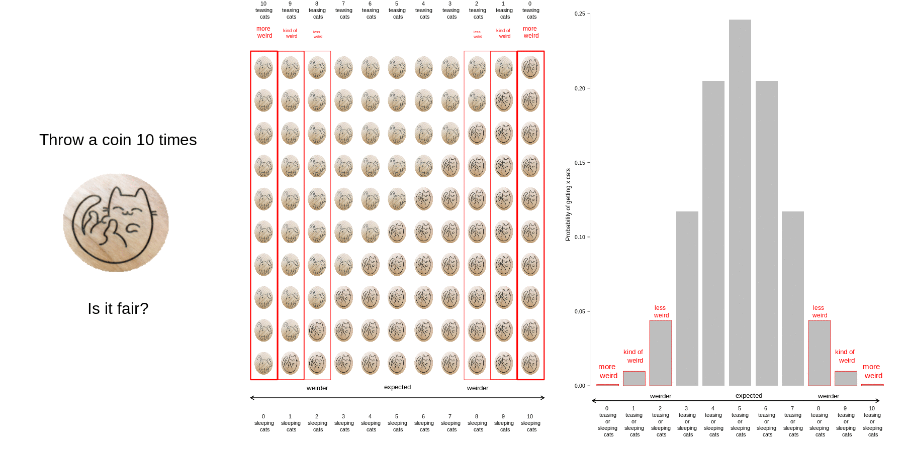

```{r setup, include=FALSE}
knitr::opts_chunk$set(echo = FALSE, eval = TRUE,message = FALSE, warning = FALSE)
library(dplyr)
library(ggplot2)
library(magick)
library(gganimate)
```

## Learing Objectives

By the end of this lab students should be able to

   + List appropriate questions posed by the biological questions and outline an appropriate hypothesis test that would answer it
   + Describe the aims of the following hypothesis tests
      + one-sample t-test
      + two-sample t-test
      + randomization test
  + List the aims of hypothesis testing and write out the appropriate null and alternative hypothesis using statistical notation
  + Write R code to carry out an hypothesis test using the appropriate variables in their dataset. Specifically write R code to carry out
     + one-sample t-test
     + two-sample t-test
     + randomization test
  + Interpret and communicate the findings of an hypothesis test accurately and concisely
  + List the limitations of the hypothesis in relation to the questions posed by the data

## Suggested reading

## Motivation

### Toss a coin 10 times.



## Differences between means

```{r t-test,fig.cap= "Source [https://crumplab.github.io/statistics/gifs.html](https://crumplab.github.io/statistics/gifs.html)"}
A<-rnorm(100,50,10)
B<-rnorm(100,50,10)
DV <- c(A,B)
IV <- rep(c("A","B"),each=100)
sims <- rep(rep(1:10,each=10),2)
df<-data.frame(sims,IV,DV)

means_df <- df %>%
               group_by(sims,IV) %>%
               summarize(means=mean(DV),
                         sem = sd(DV)/sqrt(length(DV)))

stats_df <- df %>%
              group_by(sims) %>%
              summarize(ts = t.test(DV~IV,var.equal=TRUE)$statistic)

a <- ggplot(means_df, aes(x = IV,y = means, fill = IV)) +
  geom_bar(stat = "identity") +
  geom_point(aes(x = IV, y = DV), data = df, alpha = .25) +
  geom_errorbar(aes(ymin = means - sem, ymax = means + sem), width = .2) +
  theme_classic() +
  transition_states(
    states = sims,
    transition_length = 2,
    state_length = 1
  ) + 
  enter_fade() + 
  exit_shrink() +
  ease_aes('sine-in-out')
  
a_gif <- animate(a, width = 420, height = 420)

b <- ggplot(stats_df, aes(x = ts))+
  geom_vline(aes(xintercept = ts, frame = sims))+
  geom_line(aes(x=x,y=y),
            data = data.frame(x = seq(-5,5, .1),
                              y = dt(seq(-5,5, .1), df = 18))) +
  theme_classic() +
  ylab("density") +
  xlab("t value") +
  transition_states(
    states = sims,
    transition_length = 2,
    state_length = 1
  ) +
  enter_fade() + 
  exit_shrink() +
  ease_aes('sine-in-out')

b_gif <- animate(b, width = 420, height = 420)

a_mgif <- image_read(a_gif)
b_mgif <- image_read(b_gif)

new_gif <- image_append(c(a_mgif[1], b_mgif[1]))
for(i in 2:100){
  combined <- image_append(c(a_mgif[i], b_mgif[i]))
  new_gif <- c(new_gif, combined)
}

new_gif

```

## Randomization test


```{r randomisation gif,fig.cap= "Source [https://crumplab.github.io/statistics/gifs.html](https://crumplab.github.io/statistics/gifs.html)"}
study<-round(runif(10,80,100))
no_study<-round(runif(10,40,90))

study_df<-data.frame(student=seq(1:10),study,no_study)
mean_original<-data.frame(IV=c("studied","didnt_study"),
                          means=c(mean(study),mean(no_study)))
t_df<-data.frame(sims=rep(1,20),
                 IV=rep(c("studied","didnt_study"),each=10),
                 values=c(study,no_study),
                 rand_order=rep(c(0,1),each=10))

raw_df<-t_df
for(i in 2:10){
  new_index<-sample(1:20)
  t_df$values<-t_df$values[new_index]
  t_df$rand_order<-t_df$rand_order[new_index]
  t_df$sims<-rep(i,20)
  raw_df<-rbind(raw_df,t_df)
}

raw_df$rand_order<-as.factor(raw_df$rand_order)
rand_df<-aggregate(values~sims*IV,raw_df,mean)
names(rand_df)<-c("sims","IV","means")


a<-ggplot(raw_df,aes(x=IV,y=values,color=rand_order,size=3))+
  geom_point(stat="identity",alpha=.5)+
  geom_point(data=mean_original,aes(x=IV,y=means),stat="identity",shape=21,size=6,color="black",fill="mediumorchid2")+
  geom_point(data=rand_df,aes(x=IV,y=means),stat="identity",shape=21,size=6,color="black",fill="gold")+
  theme_classic(base_size = 15)+
  coord_cartesian(ylim=c(40, 100))+
  theme(legend.position="none") +
  ggtitle("Randomization test: Original Means (purple), 
          \n Randomized means (yellow)
          \n Original scores (red,greenish)")+
  transition_states(
    sims,
    transition_length = 1,
    state_length = 2
  )+enter_fade() + 
  exit_shrink() +
  ease_aes('sine-in-out')

animate(a,nframes=100,fps=5)

```


## One way ANOVA

```{r anova gif,fig.cap= "Source [https://crumplab.github.io/statistics/gifs.html](https://crumplab.github.io/statistics/gifs.html)"}
A<-rnorm(100,50,10)
B<-rnorm(100,50,10)
C<-rnorm(100,50,10)
DV <- c(A,B,C)
IV <- rep(rep(c("A","B","C"),each=10),10)
sims <- rep(1:10,each=30)
df<-data.frame(sims,IV,DV)

means_df <- df %>%
  group_by(sims,IV) %>%
  summarize(means=mean(DV),
            sem = sd(DV)/sqrt(length(DV)))

stats_df <- df %>%
  group_by(sims) %>%
  summarize(Fs = summary(aov(DV~IV))[[1]][[4]][1])

a<-ggplot(means_df, aes(x=IV,y=means, fill=IV))+
  geom_bar(stat="identity")+
  geom_point(data=df,aes(x=IV, y=DV), alpha=.25)+
  geom_errorbar(aes(ymin=means-sem, ymax=means+sem),width=.2)+
  theme_classic(base_size = 20)+
  transition_states(
    states=sims,
    transition_length = 2,
    state_length = 1
  )+enter_fade() + 
  exit_shrink() +
  ease_aes('sine-in-out')

b<-ggplot(stats_df,aes(x=Fs))+
  geom_vline(aes(xintercept=Fs))+
  geom_vline(xintercept=qf(.95, df1=2,df2=27),color="green")+
  geom_line(data=data.frame(x=seq(0,6,.1),
                            y=df(seq(0,6,.1),df1=2,df2=27)),
            aes(x=x,y=y))+
  theme_classic(base_size = 20)+
  ylab("density")+
  xlab("F value")+
  transition_states(
    states=sims,
    transition_length = 2,
    state_length = 1
  )+enter_fade() + 
  exit_shrink() +
  ease_aes('sine-in-out')

a_gif<-animate(a,width=480,height=480)
b_gif<-animate(b,width=480,height=480)

a_mgif<-image_read(a_gif)
b_mgif<-image_read(b_gif)

new_gif<-image_append(c(a_mgif[1], b_mgif[1]))
for(i in 2:100){
  combined <- image_append(c(a_mgif[i], b_mgif[i]))
  new_gif<-c(new_gif,combined)
}

new_gif

```


## Application to the mussel dataset