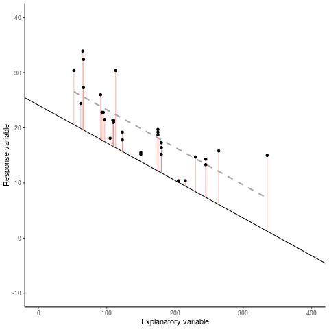

```{r setup, include=FALSE}
knitr::opts_chunk$set(echo = FALSE, eval = TRUE,message = FALSE, warning = FALSE)
library(dplyr)
library(ggplot2)
library(magick)
library(gganimate)
```

<p style="color:red;font-size:18px;">It is strongly suggested that you watch all the related videos on the CANVAS page before attempting to run through the examples below</p>

## Learing Objectives

By the end of this lab student should be able to

   + Develop a biologically relevant question of interest from the dataset and identify the following types of variables in the dataset
      + response variable
      + explanatory variable
   + Express their question of interest accurately and concisely
   + List the key assumptions of a linear model
   + Carry out and interpret tests for the existence of relationships between explanatory variables and the response in a linear model
   + Write R code to fit a linear model with a single continuous explanatory variable
   + Write R code to fit a linear model with a continuous explanatory variable and a factor explanatory variable
   + Interpret estimated effects with reference to confidence intervals from linear regression models. Specifically the interpretation of
      + the intercept
      + the effect of a factor
      + the effect of a one-unit increase in a numeric variable
      + the effect of an x-unit increase in a numeric variable
   + Make a point prediction of the response for a new observation

### Some great `r icon::fa_twitter(colour = "#1DA1F2")` threads

 <blockquote class="twitter-tweet"><p lang="en" dir="ltr">I thought it could be helpful to have a thread on ANOVA in R. As a statistical consultant, this is the most frequent FAQ I get from clients - how to run a linear model on their data, conduct hypothesis tests, extract predicted means and perform contrasts.</p>&mdash; We are R-Ladies (@WeAreRLadies) <a href="https://twitter.com/WeAreRLadies/status/1223790298024726528?ref_src=twsrc%5Etfw">February 2, 2020</a></blockquote> <script async src="https://platform.twitter.com/widgets.js" charset="utf-8"></script>

 
 <blockquote class="twitter-tweet"><p lang="en" dir="ltr">I&#39;ve made this cheat sheet and I think it&#39;s important. Most stats 101 tests are simple linear models - including &quot;non-parametric&quot; tests. It&#39;s so simple we should only teach regression. Avoid confusing students with a zoo of named tests. <a href="https://t.co/9PFR1ly3lW">https://t.co/9PFR1ly3lW</a> 1/n</p>&mdash; Jonas K. Lindeløv (@jonaslindeloev) <a href="https://twitter.com/jonaslindeloev/status/1110907133833502721?ref_src=twsrc%5Etfw">March 27, 2019</a></blockquote> <script async src="https://platform.twitter.com/widgets.js" charset="utf-8"></script>
 
 <blockquote class="twitter-tweet"><p lang="en" dir="ltr">The aov() function in <a href="https://twitter.com/hashtag/Rstats?src=hash&amp;ref_src=twsrc%5Etfw">#Rstats</a> is actually a wrapper around the lm() function <a href="https://t.co/FbvxQdtD4c">pic.twitter.com/FbvxQdtD4c</a></p>&mdash; Dan Quintana (@dsquintana) <a href="https://twitter.com/dsquintana/status/1189536788790042625?ref_src=twsrc%5Etfw">October 30, 2019</a></blockquote> <script async src="https://platform.twitter.com/widgets.js" charset="utf-8"></script>
 
 
## (Most) Hypothesis tests are just linear regression


```{r regression gif, fig.cap= "Gif inspired by [https://crumplab.github.io/statistics/gifs.html](https://crumplab.github.io/statistics/gifs.html)",eval = FALSE}
d <- mtcars
fit <- lm(mpg ~ hp, data = d)
d$predicted <- predict(fit)   ## predicted values
d$residuals <- residuals(fit) ## residuals

coefs<-coef(lm(mpg ~ hp, data = mtcars))

x<-d$hp
move_line<-c(seq(-6,6,.5),seq(6,-6,-.5))
total_error<-length(length(move_line))
cnt<-0
for(i in move_line){
  cnt<-cnt+1
  predicted_y <- coefs[2]*x + coefs[1]+i
  error_y <- (predicted_y-d$mpg)^2
  total_error[cnt]<-sqrt(sum(error_y)/32)
}

move_line_sims<-rep(move_line,each=32)
total_error_sims<-rep(total_error,each=32)
sims<-rep(1:50,each=32)

d<-d %>% slice(rep(row_number(), 50))

d<-cbind(d,sims,move_line_sims,total_error_sims)


anim<-ggplot(d, aes(x = hp, y = mpg, frame=sims)) +
  geom_smooth(method = "lm", se = FALSE, color = "darkgrey",lty = 2) +  
  geom_abline(intercept = 30.09886+move_line_sims, slope = -0.06822828)+
  lims(x = c(0,400), y = c(-10,40))+
  geom_segment(aes(xend = hp, yend = predicted+move_line_sims, color="red"), alpha = .5) + 
  geom_point() +
  theme_classic()+
  theme(legend.position="none")+
  xlab("Explanatory variable")+ylab("Response variable")+
  transition_manual(frames=sims)+
  enter_fade() + 
  exit_fade()+
  ease_aes('sine-in-out')

anim_save("../gifs/lm.gif",animate(anim,fps=5))

```



Linear models are one of the most widely used models; often thought of as simple models but they’re very flexible and able to model a wide variety of experimental and survey designs (think back to week 7). Many statistical approaches you've already heard of (think back to week 9, e.g., t-test, ANOVA etc.) are examples of linear regression and can expressed as such. 

### [Have a go at drawing your line of best fit](https://script.google.com/macros/s/AKfycbw2qx1b8iTZZXY5-aaaaGp76XiutxS1iuCFmL24IyBz6GACuSML/exec)

<figure>

</figure>

The main function for fitting linear models in R is the `lm()` function; the most important argument to this function is the first argument which specifies the model you want to fit using a model formula object which typically takes the general form *response variable ($Y$) $\sim$ explanatory variablles(s)* or *dependent variable ($Y$) $\sim$ independent variables variablles(s)*. This we can "read" as *the variation in the response variable modelled as a function ($\sim$) of the independent variables(s)*

### Specifying a model using `lm()`

| Traditional name    | Model formula  | R code  |
| ------------------- |:--------------:| -------:|
| Simple regression   | $Y \sim X_{continuous}$ | `lm(Y ~ X)` |
| One-way ANOVA       | $Y \sim X_{categorical}$      |   `lm(Y ~ X)` |
| Two-way ANOVA       | $Y \sim X1_{categorical} + X2_{categorical}$| `lm(Y ~ X1 + X2)` |
| ANCOVA              | $Y \sim X1_{continuous} + X2_{categorical}$ |`lm(Y ~ X1 + X2)` |
| Multiple regression | $Y \sim X1_{continuous} + X2_{continuous}$ | `lm(Y ~ X1 + X2)` |
| Factorial ANOVA     | $Y \sim X1{categorical} * X2_{categorical}$|   `lm(Y ~ X1 * X2)` or `lm(Y ~ X1 + X2 + X1:X2)` |


Note it's important that you get comfortable with using model formula  when using the `lm()` function (and other functions) as it's remarkably easy to specify a model which is either nonsense or isn't the model you really wanted to fit.


## Simple linear regression


  \begin{equation*}    
    Y_i = \beta_0 + \beta_1 x_i + \epsilon_i
  \end{equation*}
  \begin{equation*}
    \epsilon_i \overset{iid}{\sim} \text{Normal}(0, \sigma^2)
  \end{equation*}
  

Where, for the $i$th observation,

+ $Y_i$ is the value of the response variable
+ $x_i$ is the value of an explanatory variable
+ $\epsilon_i$ is the error; the difference between $Y_i$ and its expectation

In the above equation we want to estimate 

+ $\beta_0$ and $\beta_1$, which define the straight-line
    relationship between the explanatory variable and the expectation
    of the response
+ $\sigma^2$, the variance of $\epsilon_i$

### Key assumptions

+ The residuals are normally distributed
+ There is a linear relationship between the response and the   explanatory variables
+ The residuals have constant variance $\sigma^2$
+ Each observation is independent of the others
  

### An alternative, equivalent, way of specifying the linear regression model
  
  \begin{equation*}
    \mu_i = \beta_0 + \beta_1 x_i
  \end{equation*}
  \begin{equation*}
    Y_i \sim \text{Normal}(\mu_i, \sigma^2)
  \end{equation*}
  
Instead of specifying the model as random error, $\epsilon_i$, about
some relationship, $\beta_0 + \beta_1 x_i$, we attribute the
randomness directly to the response variable.
  

We assume the $i$th observation's response, $Y_i$, comes from a
normal distribution with mean $\beta_0 + \beta_1 x_i$ and variance
$\sigma^2$.
  
  
### Key assumptions

+ The $i$th observation's response, $Y_i$, comes from a normal distribution
+ Its mean, $\mu_i$, is a linear combination of the explanatory terms
+ Its variance, $\sigma^2$, is the same for all observations
+ Each observation's response is independent of all others
  
  
  
 
## Example and `R` code

<blockquote class="twitter-tweet"><p lang="en" dir="ltr">Stinging wasps (Hymenoptera: Aculeata), which species have the longest sting? <a href="https://t.co/VOXqqrgV3w">https://t.co/VOXqqrgV3w</a> <a href="https://t.co/IZP7IIVZQP">pic.twitter.com/IZP7IIVZQP</a></p>&mdash; PeerJ — Life and Environment Journal (@thePeerJ) <a href="https://twitter.com/thePeerJ/status/992737177489608704?ref_src=twsrc%5Etfw">May 5, 2018</a></blockquote> <script async src="https://platform.twitter.com/widgets.js" charset="utf-8"></script>

Data from [Sadler EA, Pitts JP, Wilson JS. 2018. Stinging wasps (Hymenoptera: Aculeata), which species have the longest sting? PeerJ 6:e4743 https://doi.org/10.7717/peerj.4743](https://peerj.com/articles/4743/)

```{r read in data,echo = TRUE}
## read in the data from online
stings <-read.delim(url("https://dfzljdn9uc3pi.cloudfront.net/2018/4743/1/sting_data.txt"))
## print out the first 6 rows of data
head(stings)
## Plotting the data
plot(stings$mesosoma,stings$sting, xlab = "Mesosomal Length (mm)", ylab = "Sting Length (mm)", col = factor(stings$Prey),pch = 20)
## try the same using ggplot2
library(ggplot2)
ggplot(data = stings,aes(x = mesosoma,y = sting, color = prey_graph)) +
  geom_point() + ylab("Sting Length (mm)") + xlab("Mesosomal Length (mm)") +
  scale_fill_discrete(name = "Prey")
```

### Simple linear model

$$Y_i = \beta_0 + \beta_1x_i + \epsilon_i$$
$$\epsilon_i \sim \text{Normal}(0,\sigma^2)$$
Here for observation $i$

  + $Y_i$ is the value of the response (sting length in mm)
  + $x_i$ is the value of the explanatory variable (mesosomal length in mm)
  + $\epsilon_i$ is the error term: the difference between $Y_i$ and its expected value
  
  
To fit a simple linear model to these data we, as specified above,  use the `lm()` function and include our model formula `sting ~ mesosoma` and assign the results to an object called `simple.mod`.


```{r lm,echo = TRUE}
simple.mod <- lm(sting ~ mesosoma, data = stings)
```

Notice that we've not used the \$ notation to specify the variables in our model formula, instead we’ve used the `data = stings` argument. Although the \$ notation will work (i.e., `stings$sting ~ stings$mesosoma`) it will more than likely cause you problems later on and should be avoided.

To obtain a summary of our analysis we can use the `summary()` function on our `simple.mod` model object.

```{r lmsummary,echo = TRUE}
summary(simple.mod)
```

This shows you everything you need to know about the parameter estimates (intercept and slope), their standard errors and associated $t$ statistics and p-values. The estimate for the slope (the `mesosoma` parameter estimate) suggests that for every 1mm increase in mesosomal length we'd expect a `r round(coef(simple.mod)[2],2)` mm increase in sting length.

The p-value associated with the `mesosoma` parameter tests whether the slope of this relationship is equal to zero (i.e., no relationship). As our p-value is very small (i.e., the probability of observing something as least as extreme as we did under the null hypothesis is very low) we reject this null hypothesis and therefore we may believe that the slope is different from zero (i.e. there is a relationship). The summary table also includes other important information such as the coefficient of determination (R2), adjusted R2 , F statistic, associated degrees of freedom and p-value. More about these next week.

### Think in terms of an ANOVA

$$Y_i = \beta_0 + \beta_1z_i + \epsilon_i$$
$$\epsilon_i \sim \text{Normal}(0,\sigma^2)$$
Here for observation $i$

  + $Y_i$ is the value of the response (sting length in mm)
  + $z_i$ is the prey species
  + $\epsilon_i$ is the error term: the difference between $Y_i$ and its expected value
  
However, prey is not a numeric variable. So the equation becomes

$$Y_i = \beta_0 + \beta_1 \text{Diptera?}_i + \beta_2 \text{Generalist Predator?}_i + \beta_3 \text{Hemimetabolous insects?}_i + \beta_4 \text{Herbivore?}_i + \beta_5 \text{Immature Hymenoptera?}_i + \beta_6 \text{Spiders?}_i + \beta_7 \text{Unknown?}_i  + \epsilon_i$$
where $\text{prey}_i$ is a dummy variable and $=1$ if the $i^{\text{th}}$ observation corresponded to that prey and $=0$ otherwise.

```{r anova, echo = TRUE}
anova.mod <- lm(sting ~ prey_graph,data = stings)
## Have a look back at the previous lab's notes. 
## Do you see any similarities between the outputs?
summary(anova.mod)
```

Again `summary()` shows you everything you need to know about the parameter estimates (intercept and slopes), their standard errors and associated $t$ statistics and p-values. 

Remember we are now dealing with a categorical variable so we use dummy variables (think back to the lecture video). Remember that the slopes associated with each prey value are in comparison to having `Coleoptera` as prey (this is included in the baseline). So we may conclude that given everything else in the model insects preyed on by `Diptera` have on average `r -1*round(coef(anova.mod)[2],2)` shorter stings than insects preyed on by `Coleoptera`.

However the p-value associated with the `Diptera` parameter suggests that we have no evidence to reject the null hypothesis that this slope is different from zero.

### Multiple linear regression

$$Y_i = \beta_0 + \beta_1z_i + \beta_2x_i + \epsilon_i$$
$$\epsilon_i \sim \text{Normal}(0,\sigma^2)$$
Here for observation $i$

  + $Y_i$ is the value of the response (sting length in mm)
  + $z_i$ is the prey species
  $x_i$ is the value of the explanatory variable (mesosomal length in mm)
  + $\epsilon_i$ is the error term: the difference between $Y_i$ and its expected value
  
However, as above prey is not a numeric variable. So the equation becomes

$$Y_i = \beta_0 + \beta_1 \text{Diptera?}_i + \beta_2 \text{Generalist Predator?}_i + \beta_3 \text{Hemimetabolous insects?}_i + \beta_4 \text{Herbivore?}_i + \beta_5 \text{Immature Hymenoptera?}_i + \beta_6 \text{Spiders?}_i + \beta_7 \text{Unknown?}_i + \beta_8\text{Mesosomal Length (mm)}_i + \epsilon_i$$
where $\text{prey}_i$ is a dummy variable and $=1$ if the $i^{\text{th}}$ observation corresponded to that prey and $=0$ otherwise.

```{r multiple, echo = TRUE}
multiple.mod <- lm(sting~prey_graph + mesosoma,data = stings)
## Do you notice any similarities in the estimated coefficients to the models above?
summary(multiple.mod)
```

Again `summary()` shows you everything you need to know about the parameter estimates (intercept and slopes), their standard errors and associated $t$ statistics and p-values. Looking at the `mesosoma` parameter estimate we conclude that for a observation with `Coleoptera` as prey (included in the baseline/intercept by default) we expect for every 1mm increase in mesosomal length a `r round(coef(multiple.mod)[9],2)` mm increase in sting length.


### Confidence intervals

```{r confint, echo = TRUE}
confint(multiple.mod)
```

### Interpreting confidence intervals

+ For every 1mm increase in mesosoma length we estimate the expected sting length to increases between `r round(confint(multiple.mod)[9,1],1)` and `r round(confint(multiple.mod)[9,2],1)` mm

+ We estimate that the expected sting length of a species predated by Immature Hymenoptera is between
`r round(confint(multiple.mod)[6,1],1)` and `r round(confint(multiple.mod)[6,2],1)` mm longer than that predated by Coleoptera with the same sting length

### Point prediction

For species predated by Immature Hymenoptera with mesosomal length 5mm


$$\hat{\text{Age}} = \hat{\beta_0} + \hat{\beta_5}*1 + \hat{\beta_8}*5$$
$$\downarrow$$

$$\hat{\text{Age}} = -0.99 + 4.25*1 + 0.87*5$$
$$\downarrow$$

$$7.61$$


#### In `R`

```{r pred,echo = TRUE}
## create new data frame with data we want to predict to
newdata <- data.frame(prey_graph = "Immature Hymenoptera",mesosoma = 5)
## use predict() function
predict(multiple.mod, newdata = newdata)
## round to 2 d.p
round(predict(multiple.mod, newdata = newdata),2)
```

### Plot the fitted model

One approach to interpreting your model output is to plot a graph of your data and then add the fitted model to this plot.

```{r plot mod, echo = TRUE}
library(ggplot2)
ggplot(data = stings,aes(x = mesosoma,y = sting, color = prey_graph)) +
  geom_point() + ylab("Sting Length (mm)") + xlab("Mesosomal Length (mm)") +  
  geom_line(aes(y = predict(multiple.mod)), size = 1)

```

Does this graph back up what the estimated coefficients and their respective p-values suggested? 

### Checking our assumptions

Before we sit back and relax to admire our model it is imperative that we **check the underlying assumptions**! If our assumptions are not met then basically the maths falls over and we can't reliably draw inference from the model (e.g., can't trust the parameter estimates etc.). Two of the most important assumption are:

  + equal variances (homogeneity of variance), and 
  
  + normality of residuals. 
  
To check for equal variances we can construct a graph of residuals versus fitted values; this is simple to do by first extracting the residuals and fitted values from our model object using the `resid()` and `fitted()` functions.

```{r resid, echo = TRUE}
resids <- resid(multiple.mod)
fitted <- fitted(multiple.mod)
## then plot
ggplot(mapping = aes(x = fitted, y = resids)) +
    geom_point() +
    geom_hline(yintercept = 0, colour = "red", linetype = "dashed")
```

To interpret these types of graph you are basically looking for no pattern or structure in your residuals (e.g., a "starry" night). You definitely don't want to see is the scatter increasing around the zero line (red dashed line) as the fitted values get bigger (e.g., think of a trumpet, a wedge of cheese, or even a slice of pizza) which would indicate unequal variances (heteroscedacity).

To check for normality of residuals we use a Q-Q plot (Quantile-Quantile plot) using the residuals stored in the `resids` object created above.

```{r qq, echo = TRUE}
ggplot(mapping = aes(sample = resids)) +
    stat_qq() + 
    stat_qq_line()
```

What we want here is for the `resids` (dots) to follow the 45' line, this would indicate that the model residuals were approximately Normally distributed (i.e., in line with the quantiles of a Normal distribution).

#### Doing the same using base `R`

We can get `R` to do the hard work for us by using the `plot()` function on the model object `multiple.mod`. Doing so, by default, creates 4 plots; so we should  tell `R` that we want to plot four graphs in the same plotting window `par(mfrow = c(2,2))`. This command splits the plotting window into 2 rows and 2 columns.

```{r heavy, echo = TRUE}
par(mfrow = c(2,2))
plot(multiple.mod)
```

## TL;DR 

**[Artwork by \@allison_horst](https://github.com/allisonhorst/stats-illustrations)**


## Lab work

Continue work on your Executive Summary (worth  18\% of your final grade). You are free to work through the material provided and your final report. You may work in groups, however, the final report must be your **own** work. Your Executive Summary should be no more than one A4 page. It should concisely effectively communicate your hypothesis, the statistical analysis undertaken, and your findings. Head over to the Assignments page for more information.

Potentially of interest [Reproducible reports with R markdown](https://alexd106.github.io/Rbook/rmarkdown-r.html)

### Next time INTERACTIONS (Factorial ANOVA)


```{r interactions}
ggplot(data = stings,aes(x = mesosoma,y = sting, color = prey_graph)) +
  geom_point() + ylab("Sting Length (mm)") + xlab("Mesosomal Length (mm)") +
  geom_smooth(method = "lm", se = FALSE)

```
