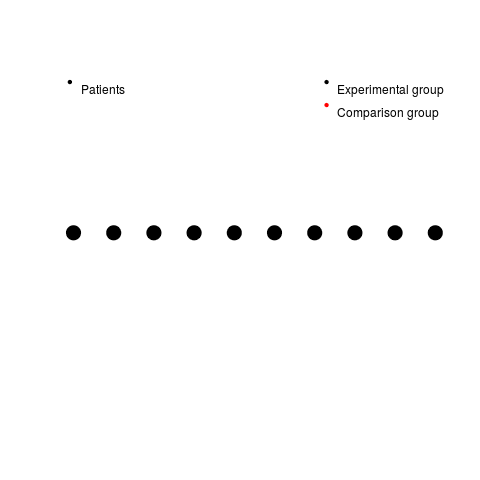
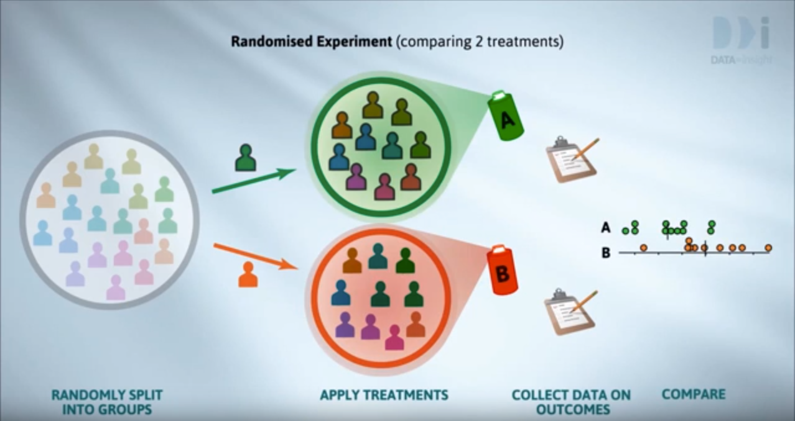
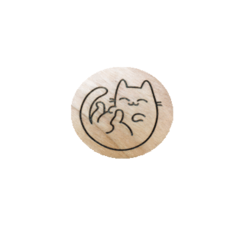

<style type="text/css">
slides > slide:not(.nobackground):after {
  content: '';
}
</style>

```{r setup, include=FALSE}
knitr::opts_chunk$set(echo = FALSE)
```

## Experimental Design

<p style="font-family: bookman, bookman; font-size:20pt"> An experiment is a set of observations made under
conditions controlled by the observer.</p>
<ul style="font-family: bookman, bookman; font-size:20pt; top:35%;position: absolute;">

<li> If the conditions are controlled we can reliably draw
conclusions about cause and effect.</li>
<li>Observational data (surveys) can be used to identify
associations but not causal relationships.</li>
</ul>

## Experimental Design


<p style="font-family: bookman, bookman; font-size:20pt"> Experiments are used to answer questions about
processes.</p>
<ul style="font-family: bookman, bookman; font-size:20pt; top:35%;position: absolute;">
<li> How do controllable inputs (treatment factors/independent variable)
impact outcomes of interest (responses/dependent variable)?</li>
<li> Experiments involve varying the inputs and
assessing the effect on the outputs.</li>
<li> The way the experiment is designed determines
which questions can be answered.</li>
</ul>

## Experimental Design

<p style="font-family: bookman, bookman; font-size:20pt"> [R. A. Fisher](https://en.wikipedia.org/wiki/Ronald_Fisher) identified three important principles that
should be considered when designing an experiment.</p>

<ul style="font-family: bookman, bookman; font-size:20pt; top:35%;position: absolute;">
<li> Randomisation </li>
<li> Replication</li>
<li> Blocking </li>

</ul>


## Randomization
<center>

</center>

## Randomization
<center>

Image from [Wild About Statistics](https://youtu.be/bi-LNLrFYcQ)
</center>

## Randomization
<center>

</center>

## Randomization

<p style="font-family: bookman, bookman; font-size:20pt">Allocation of experimental units to combinations of
treatment factor levels should be determined by a
random process.</p>
<center>

</center>

## Randomization

<ul style="font-family: bookman, bookman; font-size:30pt; top:25%;position: absolute;">
  <li> Participants assigned by chance</li>
  <li> Ensures a "Fair test"</li>
  <li> Reduce bias</li>
  <ul>
  <li> prevents selection bias </li>
  <li> insures against accidental bias </li>
 </ul>
</ul>

## Randomization

<ul style="font-family: bookman, bookman; font-size:20pt; top:25%;position: absolute;">
  <li> Ensures that each treatment has the same
probability of getting good (or bad) units and thus
avoids systematic bias.</li>
  <li> Independence</li>
  <ul>
  <li> Typically statistical analysis assumes that observations are
independent. This is almost never strictly true in practice
but randomisation means that our estimates will behave
as if they were based on independent observations.</li>
 </ul>
</ul>


## Replication

```{r repeated,message=FALSE,cache=TRUE,results='hide'}
col <- RColorBrewer::brewer.pal(3,"Set2")
plot(1:15, rep(1.5,15),col = rep(col,each = 5),pch = 17,axes = FALSE, xlab = "",ylab = "",cex = 3,ylim = c(0,2.5))
points(1:15,rep(1,15),col = rep(col,each = 5),pch = 18,cex = 3)
points(1:15,rep(0.5,15),col = rep(col,each = 5),pch = 19, cex = 3)
legend("topleft",bty = "n",pch = 17:19, col = "grey", legend = paste("Treatment", 1:3))
legend("topright",bty = "n",pch = 20, col = col, legend = paste("Patient", 1:3))

```

## Replication

<p style="font-family: bookman, bookman; font-size:20pt">Replication means that each treatment is used more than
once in the experiment.</p>

<ul style="font-family: bookman, bookman; font-size:20pt; top:35%;position: absolute;">
  <li> For true replication the entire process must be
repeated separately each time.
```{r repeatedii,message=FALSE,cache=TRUE,results='hide'}
col <- RColorBrewer::brewer.pal(3,"Set2")
plot(1:15, rep(1.5,15),col = rep(col,each = 5),pch = 17,axes = FALSE, xlab = "",ylab = "",cex = 3,ylim = c(0,2.5))
points(1:15,rep(1,15),col = rep(col,each = 5),pch = 18,cex = 3)
points(1:15,rep(0.5,15),col = rep(col,each = 5),pch = 19, cex = 3)
legend("topleft",bty = "n",pch = 17:19, col = "grey", legend = paste("Treatment", 1:3))
legend("topright",bty = "n",pch = 20, col = col, legend = paste("Patient", 1:3))

```
</ul>

## Replication


<p style="font-family: bookman, bookman; font-size:20pt">We can estimate the inherent variability in the data from
the replicate observations. This allows us to judge
whether an observed difference could be due to chance
variation.</p>

```{r repeatediii,message=FALSE,cache=TRUE,results='hide'}
col <- RColorBrewer::brewer.pal(3,"Set2")
plot(1:15, rep(1.5,15),col = rep(col,each = 5),pch = 17,axes = FALSE, xlab = "",ylab = "",cex = 3,ylim = c(0,2.5))
points(1:15,rep(1,15),col = rep(col,each = 5),pch = 18,cex = 3)
points(1:15,rep(0.5,15),col = rep(col,each = 5),pch = 19, cex = 3)
legend("topleft",bty = "n",pch = 17:19, col = "grey", legend = paste("Treatment", 1:3))
legend("topright",bty = "n",pch = 20, col = col, legend = paste("Patient", 1:3))

```

## Blocking


```{r random block2,echo = FALSE}
block <- rep(1:4, each = 4)
col <- RColorBrewer::brewer.pal(4,"Set2")
set.seed(4321)
treatment <- c(replicate(4,sample(1:4,size = 4)))
plot(1:16,rep(1,length(block)),col = rep(col,each = 4),pch = treatment + 14,axes = FALSE,xlab = "",ylab = "",cex = 3)
legend("topright",bty = "n", pch = 15:18, legend = paste("Treatment",1:4), col = "grey")
legend("topleft",bty = "n", pch = 20, col = col, legend = paste("Block",1:4))

```
  
## Blocking

<p style="font-family: bookman, bookman; font-size:20pt">Experimental units are divided into subsets (called
blocks) so that units within the same block are more
similar than units from different subsets or blocks.</p>


```{r random block1,echo = FALSE}
block <- rep(1:4, each = 4)
col <- RColorBrewer::brewer.pal(4,"Set2")
set.seed(4321)
treatment <- c(replicate(4,sample(1:4,size = 4)))
plot(1:16,rep(1,length(block)),col = rep(col,each = 4),pch = treatment + 14,axes = FALSE,xlab = "",ylab = "",cex = 3)
legend("topright",bty = "n", pch = 15:18, legend = paste("Treatment",1:4), col = "grey")
legend("topleft",bty = "n", pch = 20, col = col, legend = paste("Block",1:4))
```

## Blocking

<p style="font-family: bookman, bookman; font-size:20pt">If two units in the same block get different treatments
the treatments can be compared more precisely than if
the treatments were assigned to units in different blocks.</p>
<ul style="font-family: bookman, bookman; font-size:20pt; top:40%;position: absolute;">
  <li> Blocking allows us to increase our ability to detect
differences without increasing the size of the
experiment.

```{r random block3,echo = FALSE}
block <- rep(1:4, each = 4)
col <- RColorBrewer::brewer.pal(4,"Set2")
set.seed(4321)
treatment <- c(replicate(4,sample(1:4,size = 4)))
plot(1:16,rep(1,length(block)),col = rep(col,each = 4),pch = treatment + 14,axes = FALSE,xlab = "",ylab = "",cex = 3)
legend("topright",bty = "n", pch = 15:18, legend = paste("Treatment",1:4), col = "grey")
legend("topleft",bty = "n", pch = 20, col = col, legend = paste("Block",1:4))

```
</ul>

## Assessed lab work
<ul style="font-family: bookman, bookman; font-size:20pt; top:25%;position: absolute;">
<li>Choose a topic of interest and identify a question of interest you have related to that topic. Write a few sentences outlining the scientific question you want to answer and any hypotheses you may have.</li>

<li>Note the independent and dependent variables in your scenario.</li>

<li>Design an experiment that could help you test the hypothesis/answer the question your question of interest. Write a few short paragraphs outlining the experimental design outlining how Fisher’s three principles of experimental design have played a part.</li>
</ul>

## Assessed lab work


<ul style="font-family: bookman, bookman; font-size:15pt; top:25%;position: absolute;">
As part of this lab you are also expected to peer review 3 of your classmate’s worksheets. Although this will be an anonymous process, from the view of the lab, be aware that your feedback will be returned to your peers. When carrying out your peer review please follow the rubric given fairly and carefully.

<ul>
  <li>  Be kind </li>
  <li> Ask for clarification if something is unclear on the feedback form </li>
  <li> Point out strengths as well as weaknesses </li>
  <li> Be sure that your comments are clear and specific </li>
  <li> Be careful not to let your own opinions bias your review </li>
  </ul></ul>

## 


<ul style="font-family: bookman, bookman; font-size:30pt; top:40%;position: absolute;">
  https://b.socrative.com/login/student/
  Room Name: BIOSCI220
 </ul>

