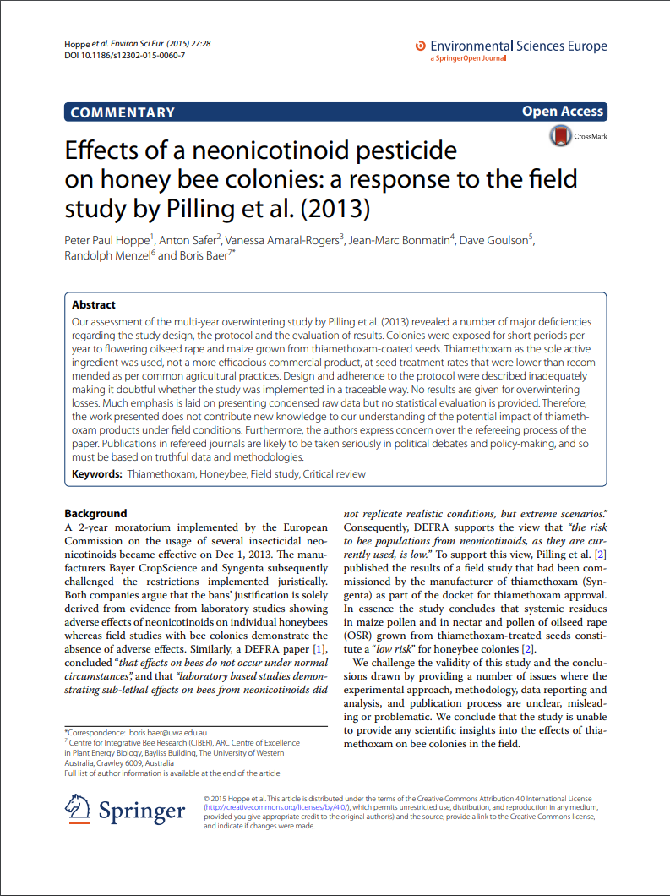

<style type="text/css">
slides > slide:not(.nobackground):after {
  content: '';
}
</style>

```{r setup, include=FALSE}
knitr::opts_chunk$set(echo = FALSE)
```

## Randomization
<center>

</center>

## Randomization
<center>

Image from [Wild About Statistics](https://youtu.be/bi-LNLrFYcQ)
</center>
## Randomization

<ul style="font-family: bookman, bookman; font-size:30pt; top:25%;position: absolute;">
  <li> Participants assigned by chance</li>
  <li> Ensures a "Fair test"</li>
  <li> Reduce bias</li>
  <ul>
  <li> prevents selection bias </li>
  <li> insures against accidental bias </li>
 </ul>
</ul>

## Randomization


<ul style="font-family: bookman, bookman; font-size:30pt; top:25%;position: absolute;">
  <li> Simple randomization</li>
</ul>


## Randomization


<ul style="font-family: bookman, bookman; font-size:20pt; top:15%;position: absolute;">
  <li> Block randomization (will talk more about blocking later)</li>
  <ul>
  <li> each block has a specified number of randomly ordered treatment assignments </li>
  </ul>
```{r random block,echo = FALSE}
block <- rep(1:4, each = 4)
set.seed(4321)
treatment <- c(replicate(4,sample(1:4,size = 4)))
plot(1:16,rep(1,length(block)),col = block,pch = treatment + 14,axes = FALSE,xlab = "",ylab = "",cex = 3)
legend("topright",bty = "n", pch = 15:18, legend = paste("Treatment",1:4), col = "grey")
legend("topleft",bty = "n", pch = 20, col = 1:4, legend = paste("Block",1:4))

```
</ul>
## Randomization


<ul style="font-family: bookman, bookman; font-size:20pt; top:15%;position: absolute;">
  <li> Stratified randomization</li>
  <ul>
  <li> participants are already in strata (blocks), and you evenly sample from those strata (blocks) </li>
  </ul>

```{r random strata,echo = FALSE}
strata <- c(rep(1,4),rep(2,3))
set.seed(1234)
treatment <- c(sample(1:4,size = 4),sample(1:3,size = 3))
plot(1:7,rep(1,length(strata)),col = strata,pch = treatment + 14,axes = FALSE,xlab = "",ylab = "",cex = 3)
legend("topright",bty = "n", pch = 15:18, legend = paste("Treatment",1:4), col = "grey")
legend("topleft",bty = "n", pch = 20, col = 1:4, legend = paste("Strata",1:2))

```
</ul>

## Replication

<ul style="font-family: bookman, bookman; font-size:20pt; top:15%;position: absolute;">
  <li> Accounts for  variation among individuals and treatments
   </ul>
```{r repeated,message=FALSE,cache=TRUE,results='hide'}
plot(1:15, rep(1.5,15),col = rep(1:3,each = 5),pch = 17,axes = FALSE, xlab = "",ylab = "",cex = 3,ylim = c(0,2.5))
points(1:15,rep(1,15),col = rep(1:3,each = 5),pch = 18,cex = 3)
points(1:15,rep(0.5,15),col = rep(1:3,each = 5),pch = 19, cex = 3)
legend("topleft",bty = "n",pch = 17:19, col = "grey", legend = paste("Treatment", 1:3))
legend("topright",bty = "n",pch = 20, col = 1:3, legend = paste("Patient", 1:3))

```

## Local Control 

<ul style="font-family: bookman, bookman; font-size:20pt; top:15%;position: absolute;">
  <li> Blocking \& Balancing (ideally) </li>
  <ul>
  <li> control sources of variation </li>
  <li> severe imbalance may induce factor confounding </li>
  </ul>
  
  ```{r random block2,echo = FALSE}
block <- rep(1:4, each = 4)
set.seed(4321)
treatment <- c(replicate(4,sample(1:4,size = 4)))
plot(1:16,rep(1,length(block)),col = block,pch = treatment + 14,axes = FALSE,xlab = "",ylab = "",cex = 3)
legend("topright",bty = "n", pch = 15:18, legend = paste("Treatment",1:4), col = "grey")
legend("topleft",bty = "n", pch = 20, col = 1:4, legend = paste("Block",1:4))

```
  </ul>

## Assessed lab work




## Assessed lab work

<ul style="font-family: bookman, bookman; font-size:20pt; top:35%;position: absolute;">
  <li>  Be kind </li>
  <li> Ask for clarification if something is unclear on the feedback form </li>
  <li> Point out strengths as well as weaknesses </li>
  <li> Be sure that your comments are clear and specific </li>
  <li> Be careful not to let your own opinions bias your review </li>
  </ul>
