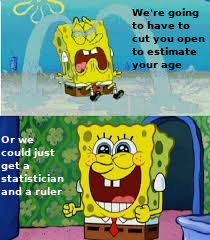

<style type="text/css">
slides > slide:not(.nobackground):after {
  content: '';
}
</style>

```{r setup, include=FALSE}
knitr::opts_chunk$set(echo = FALSE, eval = TRUE,message = FALSE, warning = FALSE)
library(dplyr)
library(ggplot2)
library(magick)
library(gganimate)
```

## Learning objectives (linear modelling)

<ul style="font-family: bookman, bookman; font-size:20pt; top:35%;position: absolute;">
<li> Fit a linear model with multiple explanatory variables in `R`</li>
<li> Interpret coefficients of a linear model with multiple
explanatory variables</li>
<li> Make a point prediction of the response for a new observation</li>
</ul>


## Introduction to linear modelling

```{r regression gif, fig.cap= "Gif inspired by [https://crumplab.github.io/statistics/gifs.html](https://crumplab.github.io/statistics/gifs.html)"}
d <- mtcars
fit <- lm(mpg ~ hp, data = d)
d$predicted <- predict(fit)   ## predicted values
d$residuals <- residuals(fit) ## residuals

coefs<-coef(lm(mpg ~ hp, data = mtcars))

x<-d$hp
move_line<-c(seq(-6,6,.5),seq(6,-6,-.5))
total_error<-length(length(move_line))
cnt<-0
for(i in move_line){
  cnt<-cnt+1
  predicted_y <- coefs[2]*x + coefs[1]+i
  error_y <- (predicted_y-d$mpg)^2
  total_error[cnt]<-sqrt(sum(error_y)/32)
}

move_line_sims<-rep(move_line,each=32)
total_error_sims<-rep(total_error,each=32)
sims<-rep(1:50,each=32)

d<-d %>% slice(rep(row_number(), 50))

d<-cbind(d,sims,move_line_sims,total_error_sims)


anim<-ggplot(d, aes(x = hp, y = mpg, frame=sims)) +
  geom_smooth(method = "lm", se = FALSE, color = "darkgrey",lty = 2) +  
  geom_abline(intercept = 30.09886+move_line_sims, slope = -0.06822828)+
  lims(x = c(0,400), y = c(-10,40))+
  geom_segment(aes(xend = hp, yend = predicted+move_line_sims, color="red"), alpha = .5) + 
  geom_point() +
  theme_classic()+
  theme(legend.position="none")+
  xlab("Explanatory variable")+ylab("Response variable")+
  transition_manual(frames=sims)+
  enter_fade() + 
  exit_fade()+
  ease_aes('sine-in-out')

animate(anim,fps=5)

```


## The P$\overline{\text{a}}$ua dataset

<p style="font-family: bookman, bookman; font-size:20pt"> The P$\overline{\text{a}}$ua dataset contains the following variables</p>
<ul style="font-family: bookman, bookman; font-size:20pt; top:35%;position: absolute;">
<li> Age of  P$\overline{\text{a}}$ua in years (calculated from counting rings in the
cone) </li>
<li> Length of  P$\overline{\text{a}}$ua shell in centimeters</li>
<li> Species of  P$\overline{\text{a}}$ua: *Haliotis iris* (typically found in NZ) and
*Haliotis australis* (less commonly found in NZ) </li>

</ul>


## How old am I?
<div>

*Haliotis australis* </div>
<div>

*Haliotis iris* </div>

## How old am I?
<center>

</center>
## How old am I?

```{r head,echo = 2}
paua <- read.csv("../data/paua.csv")
head(paua)
```

## Simple linear regression

$$Y_i = \beta_0 + \beta_1x_i + \epsilon_i$$
$$\epsilon_i \sim \text{Normal}(0,\sigma^2)$$
Here for observation $i$

  + $Y_i$ is the value of the response (in our case Age of P$\overline{\text{a}}$ua)
  + $x_i$ is the value of the explanatory variable (Length of P$\overline{\text{a}}$ua shell)
  + $\epsilon_i$ is the error term: the difference between $Y_i$ and its expected value

## Simple linear regression

```{r sl,message=FALSE}
library(emoGG)
ggplot(data = paua,aes(x = Length, y = Age)) +
  geom_emoji(emoji="1f41a") + xlab("Length of shell (cm)") +
  ylab("Age (years)")

```

## Simple linear regression

```{r sll,message=FALSE}
ggplot(data = paua,aes(x = Length, y = Age)) +
  geom_emoji(emoji="1f41a") + xlab("Length of shell (cm)") +
  ylab("Age (years)") +
  geom_smooth(method = "lm",se = FALSE)

```

## But we have more information

```{r slli,message=FALSE}
ggplot(data = paua,aes(x = Length, y = Age)) +
  geom_emoji(emoji="1f41a") + xlab("Length of shell (cm)") +
  ylab("Age (years)") + geom_emoji(data = paua[paua$Species =="Haliotis iris",],emoji="1f9aa") +
  geom_emoji(data=data.frame(x = 2,y = 12.5),aes(x = x, y = y),emoji="1f41a") +
  geom_emoji(data=data.frame(x = 2,y = 11.5),aes(x = x, y = y),emoji="1f9aa") +
  annotate("text",x = 2.75,y = 12.5,label = "Haliotis australis") +
  annotate("text",x = 2.75,y = 11.5,label = "Haliotis iris")

```

## Multiple linear regression

+ To fit a simple linear model (one explanatory variable, Length)

```{r simple,echo = TRUE, eval = FALSE}
simple.mod <- lm(Age ~ Length, data = paua)
```

+ To fit an ANOVA style model (Species as an explanatory variable)

```{r anova, echo = TRUE}
anova.mod <- lm(Age ~ Species, data = paua)
```

+ Putting both variables in the model

```{r mult, echo = TRUE}
multiple.mod <- lm(Age ~ Length + Species, data = paua)
```

## Multiple linear regression

$$Y_i = \beta_0 + \beta_1x_i + \beta_2 z_i + \epsilon_i$$
$$\epsilon_i \sim \text{Normal}(0,\sigma^2)$$
Here for observation $i$

  + $Y_i$ is the value of the response (Age of P$\overline{\text{a}}$ua)
  + $x_i$ is the value of one explanatory variable (e.g., Length of P$\overline{\text{a}}$ua shell)
  + $z_i$ is the value of another explanatory variable (e.g., Species of P$\overline{\text{a}}$ua)
  + $\epsilon_i$ is the error term: the difference between $Y_i$ and its expected value

## Multiple linear regression
For the $i^{\text{th}}$ observation
$$Y_i = \beta_0 + \beta_1x_i + \beta_2 z_i + \epsilon_i$$
$$\downarrow$$
$$\text{Age}_i = \beta_0 + \beta_1\text{Length}_i + \beta_2 \text{Species}_i + \epsilon_i$$

## Multiple linear regression
However, Species is not a numeric variable. So the equation becomes

$$\text{Age}_i = \beta_0 + \beta_1\text{Length}_i + \beta_2 \text{Haliotis iris?}_i + \epsilon_i$$
Where

+ Haliotis iris? is a dummy variable which $=1$ if the $i^{\text{th}}$ P$\overline{\text{a}}$ua is *Haliotis iris* and $=0$ otherwise
+ The baseline (intercept) $\beta_0$ includes the reference factor variable. In this case *Haliotis australis*


## Multiple linear regression

 + For *Haliotis australis*
 $$\text{Age}_i = \beta_0 + \beta_1\text{Length}_i + \epsilon_i$$
 
 + For *Haliotis iris*
 $$\text{Age}_i = (\beta_0 + \beta_2)+ \beta_1\text{Length}_i + \epsilon_i$$
 
## Estimated coefficients


```{r summary, echo = TRUE,tidy=TRUE,tidy.opts=list(width=10)}
summary(multiple.mod)
```


## Interpreting the coefficients

+ For every 1cm increase in Length we estimate the expected Age increases by `r round(coef(multiple.mod)[2],1)` years

+ We estimate that the expected age of a *Haliotis iris* is `r -1*round(coef(multiple.mod)[3],1)` years younger than that of a *Haliotis australis* of the same length

## Confidence intervals

```{r confint, echo = TRUE}
confint(multiple.mod)
```

## Interpreting confidence intervals

+ For every 1cm increase in Length we estimate the expected Age increases between `r round(confint(multiple.mod)[2,1],1)` and `r round(confint(multiple.mod)[2,2],1)` years

+ We estimate that the expected age of a *Haliotis iris* is between
`r -1*round(confint(multiple.mod)[3,2],1)` and `r -1*round(confint(multiple.mod)[3,1],1)` years younger than that of a *Haliotis australis* of the same length


## Estimated Age

+ For a *Haliotis iris* of length 5cm


$$\hat{\text{Age}} = \hat{\beta_0} + \hat{\beta_1}5 + \hat{\beta_2}1$$
$$\downarrow$$

$$\hat{\text{Age}} = 3.16 + 0.76 \times 5 - 2.42 \times 1$$

$$\downarrow$$

$$4.54$$


## Estimated Age in `R`

```{r pred,echo = TRUE}
## create new data frame with data we want to predict to
newdata <- data.frame(Length = 5, Species = "Haliotis iris")
## use predict() function
predict(multiple.mod, newdata = newdata)

```

## Fitted model


```{r sllfi,message=FALSE}
fitlm = lm(Age ~ Species + Length, data = paua)
paua$predlm = predict(fitlm)
ggplot(data = paua,aes(x = Length, y = Age,color = Species)) +
  geom_emoji(emoji="1f41a") + xlab("Length of shell (cm)") +
  ylab("Age (years)") + geom_emoji(data = paua[paua$Species =="Haliotis iris",],emoji="1f9aa") +
  geom_emoji(data=data.frame(x = 2,y = 12.5,Species = "1"),aes(x = x, y = y),emoji="1f41a") +
  geom_emoji(data=data.frame(x = 2,y = 11.5,Species = "2"),aes(x = x, y = y),emoji="1f9aa") +
  annotate("text",x = 2.75,y = 12.5,label = "Haliotis australis",color = "red") +
  annotate("text",x = 2.75,y = 11.5,label = "Haliotis iris",color = "blue") + geom_line(aes(y = predlm), size = 1) + theme(legend.position = "none") +
  scale_colour_manual(values=c("Haliotis australis" = "red","Haliotis iris" = "blue","1" = "black","2" = "green"))

```

## Fitted model

```{r sllfip,message=FALSE}
ggplot(data = paua,aes(x = Length, y = Age,color = Species)) +
  geom_emoji(emoji="1f41a") + xlab("Length of shell (cm)") +
  ylab("Age (years)") + geom_emoji(data = paua[paua$Species =="Haliotis iris",],emoji="1f9aa") +
  geom_emoji(data=data.frame(x = 2,y = 12.5,Species = "1"),aes(x = x, y = y),emoji="1f41a") +
  geom_emoji(data=data.frame(x = 2,y = 11.5,Species = "2"),aes(x = x, y = y),emoji="1f9aa") +
  annotate("text",x = 2.75,y = 12.5,label = "Haliotis australis",color = "red") +
  annotate("text",x = 2.75,y = 11.5,label = "Haliotis iris",color = "blue") + geom_line(aes(y = predlm), size = 1) + theme(legend.position = "none") +
  scale_colour_manual(values=c("Haliotis australis" = "red","Haliotis iris" = "blue","1" = "black","2" = "green"))

```

But, what if the lines aren't parallel?

## Next Time INTERACTIONS

```{r sllfipi,message=FALSE}
ggplot(data = paua,aes(x = Length, y = Age,color = Species)) +
  geom_emoji(emoji="1f41a") + xlab("Length of shell (cm)") +
  ylab("Age (years)") + geom_emoji(data = paua[paua$Species =="Haliotis iris",],emoji="1f9aa") +
  geom_emoji(data=data.frame(x = 2,y = 12.5,Species = "1"),aes(x = x, y = y),emoji="1f41a") +
  geom_emoji(data=data.frame(x = 2,y = 11.5,Species = "2"),aes(x = x, y = y),emoji="1f9aa") +
  annotate("text",x = 2.75,y = 12.5,label = "Haliotis australis",color = "red") +
  annotate("text",x = 2.75,y = 11.5,label = "Haliotis iris",color = "blue") + geom_smooth(method = "lm", se = FALSE) + theme(legend.position = "none") +
  scale_colour_manual(values=c("Haliotis australis" = "red","Haliotis iris" = "blue","1" = "black","2" = "green"))

```


## 


<ul style="font-family: bookman, bookman; font-size:30pt; top:40%;position: absolute;">
  https://b.socrative.com/login/student/
  Room Name: BIOSCI220
 </ul>

