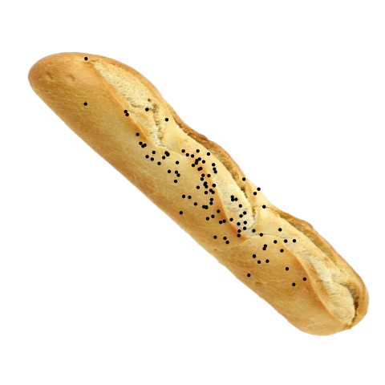
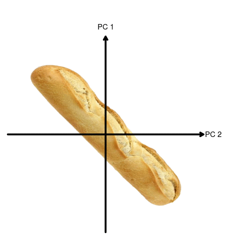
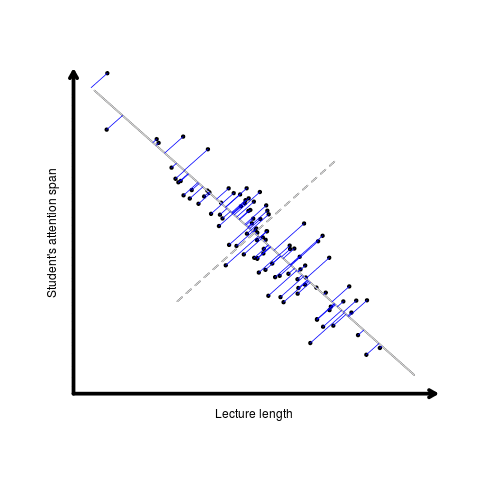

<style type="text/css">
slides > slide:not(.nobackground):after {
  content: '';
}
</style>

```{r setup, include=FALSE}
knitr::opts_chunk$set(echo = FALSE, eval = TRUE,message = FALSE, warning = FALSE,fig.align = "center")
```

## Multivariate data (with wine)

```{r read wine data,echo = 3}
wine <- read.table("http://archive.ics.uci.edu/ml/machine-learning-databases/wine/wine.data",sep=",")[2:14]
names(wine) <- paste("V",1:13,sep = "")
head(wine)
```

<p style="font-family: bookman, bookman; font-size:20pt">13 different variables describing Italian wines</p>

## Can you visualise in 13 dimensions?

```{r plot wine data,echo = FALSE}
library(GGally)
ggpairs(wine)

```

## What about 6?

```{r plot subwine data,echo = FALSE}
ggpairs(wine[,1:6])

```


## Standardising variables

<p style="font-family: bookman, bookman; font-size:20pt">Variable range?</p>

```{r, var,eval = TRUE, echo = TRUE}
apply(wine,2,range)
```


## Standardising variables

<p style="font-family: bookman, bookman; font-size:20pt">If you want to compare different variables that have different units, and very different variances, you should **standardise** the variables.</p>


```{r, eval = TRUE, echo = TRUE}
wine_scaled <- as.data.frame(apply(wine,2,scale))
head(wine_scaled)
```

## Only the scale has changed

```{r plot subwinesc data,echo = FALSE}
ggpairs(wine_scaled[,1:6])

```

## PCA

<ul style="font-family: bookman, bookman; font-size:20pt; top:35%;position: absolute;">
<li> The purpose of principal component analysis is to find the best low-dimensional representation of the variation in a multivariate data set.</li>
<li> Using PCA we can investigate whether we can capture most of the variation between samples using a smaller number of new variables (principal components), where each of these new variables is a linear combination of all or some of the previous ones.</li>
</ul>


## PCA

<center>

</center>

## PCA 

<center>

</center>

## PCA 

<center>

</center>

## PCA in `R`

```{r pca,echo = TRUE}
## carry out PCA
pca <- prcomp(wine_scaled)
## Summary of PCA
summary(pca)
```

## PCA in `R` (How many Principal Components to retain?)

```{r scree,echo = TRUE}
## scree plot (proportion of variance explained)
screeplot(pca,type = "lines")
```

## PCA in `R` (loadings)

```{r loading,echo = TRUE}
loadings <- pca$rotation
## have a look at the structure
str(loadings)
## lets just look at the first
loadings[,1]
```

## PCA in `R` (loadings)

```{r loading1,echo = TRUE}
loadings[,1]
```

<p style="font-family: bookman, bookman; font-size:20pt">This means that the principal component is a linear combination of our (statndardised) variables as follows.</p>

`r  paste("(",round(loadings[,1],2),")","Z",1:13,sep = "",collapse = "+")`

where Z1...Z13 are the variables in the `wine_scaled` dataset

## PCA in `R` (accessing these Principal Components)

```{r pc,echo = TRUE}
pcs <- pca$x
## have a look at the structure
str(pcs)
## let's print out the first six values of PC1
head(pcs[,1])
```

## PCA in `R` 
<p style="font-family: bookman, bookman; font-size:20pt">Three basic types of information we obtain from a PCA:</p>
<ul style="font-family: bookman, bookman; font-size:20pt; top:35%;position: absolute;">
  <li> PC scores: the coordinates of our samples on the new PC axis</li>
  <li> Eigenvalues: represent the variance explained by each PC </li>
  <li> Variable loadings (eigenvectors): these reflect the weight that each variable has on a particular PC </li>
  </ul>

## Assessed lab work (make a PCA cheatsheet)


## Assessed lab work

<ul style="font-family: bookman, bookman; font-size:20pt; top:35%;position: absolute;">
  <li> Be kind </li>
  <li> Point out strengths as well as weaknesses </li>
  <li> Be sure that your comments are clear and specific </li>
  <li> Follow the rubric carefully  </li>
  <li> You will be expected to mark 3, randomly selected, cheatsheets </li>
  </ul>

## 


<ul style="font-family: bookman, bookman; font-size:30pt; top:40%;position: absolute;">
  https://b.socrative.com/login/student/
  Room Name: BIOSCI220
 </ul>

