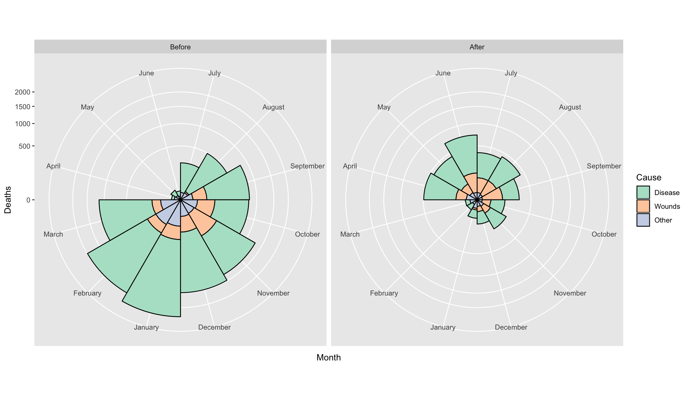

class: inverse, center, middle

# `R` and `RStudio`
## Week 1


```{r setup, include=FALSE}
options(htmltools.dir.version = FALSE)
```
```{r xaringan-themer, include=FALSE, warning=FALSE}
library(xaringanthemer)
style_solarized_light()
```

<style type="text/css">
.remark-slide-content {
    font-size: 30px;
    padding: 1em 4em 1em 4em;
}
</style>


---
class: inverse


.small[
### Learning objectives
+ **Define** the difference between `R` and `RStudio`
+ **Express** the benefits and issues associated with these software being used in the scientific community
+ **Distinguish** between different data types (e.g., integers, characters, logical, numerical)
+ **Explain** what an `R` function is; **describe** what an argument to an `R` function is
]

---
class: inverse


.small[
### Learning objectives
+ **Explain** what an `R` package is; **distinguish** between the functions `install.packages()` and `library()`
+ **Explain** what a *working directory* is in the context of `R`
+ **Interpret** and fix basic  `R` errors
+ **Use** the appropriate `R` function to read in a `.csv` data; **carry out** basic exploratory data analysis using `tidyverse` (use the pipe operator, `%>%` when summarising a `data.frame`); create simple plots of the data.
]

---
class: center, middle


The selling pitch of this course states that *...biological research has actually been heavily quantitative for 100+ years...* and promises that *...it is now essential for biology students to acquire skills in working with and visualising data, learning from data using models...*. We're not making it up! 

---

## Why `R`? 
### not an extensive list

--
+ Free

--
+ Open source

--
+ Huge online support network

--
+ Flexible; if you can code it you can do it!

--
+ Everybody's doing it...


---

## a`R`t

.pull-left[
```{r, eval = FALSE}
## devtools::install_github("djnavarro/turmite59")
turmite59::turmite59("blue")

```
]

.pull-right[

]

.footnote[[Artwork by @djnavarro](https://djnavarro.net/)]

---

## Why `RStudio`? 
### not an extensive list

--
+ Works nicely with `R`

--
+ Huge online support network

--
+ Flexible; so, so, many tools and additions!

--
+ Reproduciblity

---
class: inverse, center, middle


[Artwork by @allison_horst](https://github.com/allisonhorst/stats-illustrations)

---

## Terminology

--

+ **running** code: the act of telling R to perform an act by giving it commands in the console
--

+ **objects**: what values are stored in
--

+ **script**: a text file containing a set of commands and comments
--

+ **comments**: notes written within a **script** to better document/explain what's happening
--

---

## More terminology

--

+ **functions**: `R` commands that tell your computer what to do
--

+ **arguments**: inputs we give to **functions** that are used by that **function** to give some output
--

+ **packages**: a collection of specific **functions** 

---

## Errors

```{r error, error = TRUE}
library(tidy)
```

---

## Errors

```{r error2, error = TRUE}
lbrary(tidyverse)
```

---

## Errors

```{r error3, error = TRUE}
paua <- read_csv("paua.csv")
```

---

## Errors

```{r error4, error = TRUE, message = FALSE}
library(tidyverse)
paua <- read_csv("paua.csv")
```


---

```{r, echo = FALSE, include=FALSE}
library(flipbookr)
```

```{r example_read, include = FALSE}
library(tidyverse)
paua <- read_csv("../data/paua.csv")
glimpse(paua)
```


`r chunk_reveal(chunk_name = "example_read", title = "### Everything working nicely!")`

---
```{r example_mean, include = FALSE}
paua %>%
  group_by(Species) %>%
  summarise(av_length = mean(Length))
```


`r chunk_reveal(chunk_name = "example_mean", title = "### Everything working nicely!")`

---
```{r example_plot, include = FALSE}
library(ggplot2)
ggplot(data = paua,aes(x = Species, y = Length)) + 
  geom_boxplot()
  
```

`r chunk_reveal(chunk_name = "example_plot", title = "### Everything working nicely!")`


---

class: inverse, center, middle

# Data exploration and visualization
## Week 2

---
class: inverse


.small[
### Learning objectives
+ **Define** data sovereignty and **explain** this in relation to a researcher's obligation when collecting, displaying, and analysing data
+ **Define** and **discuss** Māori Data Sovereignty principles
+ **Carry out** and **interpret** the outputs of basic exploratory data analysis using in-built R functions
+ **Create** and **communicate** informative data visualisations using `R`
+ **Discuss** and **critique** data visualisations

]

---
### Data Sovereignty?

+ Data Sovereignty typically refers to the understanding that **data is subject to the laws of the nation within which it is stored**

+ Indigenous Data Sovereignty perceives **data as subject to the laws of the nation from which it is collected**

---

### What is Māori Data Sovereignty?

+ Māori Data Sovereignty recognises that **Māori data should be subject to Māori governance**

+ Māori Data Sovereignty **supports tribal sovereignty** and the **realisation of Māori and Iwi aspirations**


---

### Te Mana Raraunga

```{r, echo  = FALSE}
knitr::include_url("https://www.temanararaunga.maori.nz/", height = "400px")
```

---

### `tidy` data

 1. Each variable must have its **own column**
 2. Each observation must have its **own row**
 3. Each value must have its **own cell**


---
### Data manipulation

```{r penguins, results='hide'}
library(palmerpenguins) ## contains some nice penguin data
penguins %>% 
  apply(.,2,is.na) %>%
  apply(.,2,sum)
```


---
`r chunk_reveal(chunk_name = "penguins", title = "### Data manipulation")`

---
### Data manipulation

```{r penguins_na, results='hide'}
penguins_nafree <- penguins %>% drop_na()
penguins_nafree
```

---

`r chunk_reveal(chunk_name = "penguins_na", title = "### Data manipulation")`

---
### Data manipulation

```{r penguins_av,results='hide'}
penguins_nafree %>% 
  group_by(species) %>% 
  summarise(avgerage_bill_length = mean(bill_length_mm))
```

---

`r chunk_reveal(chunk_name = "penguins_av", title = "### Data manipulation")`

---
class: center, middle

## Data Viz

> "...have obligations in that we have a great deal of power over how people ultimately make use of data, both in the patterns they see and the conclusions they draw." `r tufte::quote_footer('--- Michael Correll, Ethical Dimensions of Visualization Research')`

---
### Exploratory plots

  + data **exploration**
  + doesn't have to look pretty
  + just needs to **get to the point**
  + **explore** and **discover** new data facets
  + formulate **new questions**
  
---
**[slido.com](slido.com) code #biosci220: what do you think of this plot?**

`r countdown::countdown(minutes = 2, seconds = 0, bottom = 0)`
  
```{r example, echo = FALSE, fig.cap="", warning = FALSE, message = FALSE}
ggplot(data = penguins_nafree, aes(x = bill_length_mm, y = bill_depth_mm, color = species)) +
  geom_point()
```

---

### Explanatory plots
#### most common kind of graph used in scientific publications

   + **clear** purpose
   + designed for the audience
   + make it **easy to read** (*this covers a lot of things*)
   + do not distort
   + guide the reader to a **particular conclusion**
   + answer a **specific question**
   + **support** a decision
   
---

.small[
> "Scientific visualization is classically defined as the process of graphically displaying scientific data ... There are so many different ways to represent the same data: scatter plots, linear plots, bar plots, and pie charts ... the same data, using the same type of plot, may be perceived very differently depending on who is looking at the figure." `r tufte::quote_footer('--- Nicolas P. Rougier, Michael Droettboom, Philip E. Bourne, Ten Simple Rules for Better Figures ')`
]

---

**[slido.com](slido.com) code #biosci220: what do you think of this plot?**

`r countdown::countdown(minutes = 2, seconds = 0, bottom = 0)`
  
```{r, echo = FALSE}

```

.footnote[[Create this yourself](https://rpubs.com/kwlee58/492913)]
---

### [Ten Simple Rules for Better Figures](https://journals.plos.org/ploscompbiol/article?id=10.1371/journal.pcbi.1003833)

 + **Know** Your Audience
 
 + **Identify** Your Message
 
 + **Adapt** the Figure to the Support Medium
 
 + **Captions** Are Not Optional
 
 + **Do Not** Trust the Defaults
 
---

### [Ten Simple Rules for Better Figures](https://journals.plos.org/ploscompbiol/article?id=10.1371/journal.pcbi.1003833)

 + Use **Color** Effectively
 
 + **Do Not Mislead** the Reader
    
 + **Avoid** *Chartjunk*
 
 + **Message** Trumps Beauty

 + Get the Right **Tool**


---
### Introducing `ggplot2`

Every `ggplot2` plot has three key components:

  + `data`,

  + A set of `aes`thetic mappings between variables in the data and visual properties, and

  + At least one layer which describes how to render each observation. Layers are usually created with a `geom` function.

---

###  `ggplot2`


---

```{r bar, fig.show='hide'}
ggplot(penguins_nafree, aes(x = species, fill = sex)) +
  geom_bar(alpha = 0.8, position = "dodge") +
  facet_wrap(~island) +
  xlab("") +
  theme_linedraw() + 
  scale_fill_manual(values = c("cyan4","darkorange"), name = "Sex") 
```

---

`r chunk_reveal(chunk_name = "bar", title = "")`

---


```{r point, fig.show='hide'}
ggplot(data = penguins_nafree, aes(x = bill_length_mm, y = bill_depth_mm)) +
  geom_point(aes(color = species),size = 2)  +
  scale_color_manual(values = c("darkorange","darkorchid","cyan4"), name = "") +
  theme_bw() + ## Oo a new theme
  xlab("Bill length (mm)") +
  ylab("Bill length (mm)")
```

---

`r chunk_reveal(chunk_name = "point", title = "")`

---
class: center, middle

### **[slido.com](slido.com) code #biosci220: what does a plot tell us about our data?**

`r countdown::countdown(minutes = 2, seconds = 0, bottom = 0)`

---
#### Between group variation

```{r, echo = FALSE}
means <- penguins_nafree %>% group_by(species) %>% summarise(means = mean(bill_length_mm))
mean <- mean(penguins_nafree$bill_length_mm)
means$ends <- mean
means$lag1 <- means$means[c(2,3,1)]
means$lag2 <- means$means[c(3,1,2)]
ggplot(penguins_nafree,aes(x = species, y = bill_length_mm)) + 
    geom_violin()  + 
  ylab("Bill length (mm)") +
  xlab("Species") +
  geom_point(data = means, aes(x = species, y = means),color = "blue", size = 2) +
  annotate(geom = 'text', label = "Average bill length per species" , x = -Inf, y = Inf, hjust = 0, vjust = 1.2, color = "blue") +
  geom_hline(yintercept = mean, color = "red") +
  annotate(geom = 'text', label = "Overall average bill length" , x = -Inf, y = Inf, hjust = 0, vjust = 3, color = "red") +
  geom_segment(data = means, aes(x = species, y = means, xend = species, yend = ends),col = "darkgreen", size = 2)  +
  annotate(geom = 'text', label = "Differences to overall average" , x = -Inf, y = Inf, hjust = 0, vjust = 5, color = "darkgreen") +
  geom_hline(data = means, aes(yintercept = means), color = "blue", alpha = 0.3, lty = 2) + 
  geom_segment(data = means, aes(x = as.numeric(species) - 0.15, y = means, 
                                 xend = as.numeric(species) - 0.15, yend = lag1),col = "purple", size = 2) +
  geom_segment(data = means, aes(x = as.numeric(species) + 0.15, y = means, 
                                 xend = as.numeric(species) + 0.15, yend = lag2),col = "purple", size = 2)+
  annotate(geom = 'text', label = "Differences between groups" , x = -Inf, y = Inf, 
           hjust = 0, vjust = 7, color = "purple")
```

---

#### Within group variation

```{r,echo = FALSE}
jit <- ggplot() + 
  geom_jitter(data = penguins_nafree,aes(x = species, y = bill_length_mm, color = species), alpha = 0.2) 

penguins_nafree$x_points <- layer_data(jit)$x
penguins_nafree$y_points <- layer_data(jit)$y
penguins_nafree <- penguins_nafree %>% group_by(species) %>% mutate(sp_means = mean(bill_length_mm))

ggplot() + 
  ylab("Bill length (mm)") +
  xlab("Species") +
  geom_point(data = means, aes(x = species, y = means, color = species), size = 2) +
  geom_text(data = means, aes(x = species, y = means + 2.5, color = species, 
                              label = paste0("Species average = ",round(means,3)))) +
  geom_hline(data = means, aes(yintercept = means, color = species), alpha = 0.3, lty = 2) +
  geom_point(data = penguins_nafree,aes(x = x_points, y = y_points, color = species), alpha = 0.2) +
  theme(legend.position = "none") + 
  geom_segment(data = penguins_nafree, aes(x = x_points, y = y_points, xend = x_points, 
                                 yend = sp_means,color = species), size = 1, alpha = 0.2) 
```

---

class: inverse, center, middle

# Hypothesis testing and introduction to linear regression
## Week 3

---

class: inverse


.small[
### Learning objectives
+ **Formulate** a question/hypothesis to investigate based on the given data
+ **List** the aims, write out the appropriate null and alternative hypothesis using statistical notation for, and write `R` code to carry out a
    + one-sample t-test
    + two-sample t-test (independent and dependent)
    + randomization test
    + one-way Analysis of Variance (ANOVA)
+ Correctly **interpret** and **communicate** a p-value in terms of the hypotheses test listed above

]

---

class: inverse

.small[
### Learning objectives
+ **State** in terms of probability statements the meaning of the power and significance level of an hypothesis test
+ **Explain** and **discuss** the limitations of statistical linear regression, with a single factor explanatory variable
+ **Interpret** and **communicate** the estimated coefficients of a linear regression model with a single factor explanatory variable to both a statistical and non-statistical audience; discuss and critique model fit
 ]
 
---
 
### One-Sample t-test

```{r vio1, echo = FALSE}
## violin plot with transparent points
os <- ggplot(paua,aes(x = 1,y = Length)) + 
  geom_violin() +
  geom_jitter(alpha = 0.4) +
  ylab("Length (cms)") + xlab("") +
  theme_classic() +
  geom_point(aes(x = 1, y = mean(Length)), size = 2) +
  geom_hline(aes( yintercept = mean(Length)), lty = 2, alpha = 0.5) +
  theme(legend.position = "none") +
  geom_text(aes(x = 1, y = mean(Length) + 0.5, label = paste0("Averege = ",round(mean(Length),3)))) +
  theme(axis.title.x=element_blank(),
        axis.text.x=element_blank(),
        axis.ticks.x=element_blank())
os
  
```

---

How do we reflect our uncertainty about the population mean? 

--

**remember it's the population we want to make inference on based on our sample!**

--

Enter the Standard Error of the Mean, **SEM**,  $= \frac{\sigma}{\sqrt{n}}$

---

In `R`: 

```{r sem}
sem <- paua %>% summarise(mean = mean(Length),
                   sem = sd(Length)/sqrt(length(Length)))
sem
  
```

---


**Back to our hypothesis test**

**Question:** Do we believe that the average length of Pāua shells is 5cm?

**Formalizing into a hypothesis test:**  

 + *Null hypothesis*: On average Pāua shells are 5cm long
 + *Alternative hypothesis*: On average Pāua shells are **not** 5cm long
 + *Notationally*: $H_0: \mu = 5$ vs $H_1: \mu \neq 5$ ( $\mu$ is the proposed mean)
 
---
 
**Calculating a statistic** (*we use a t-statistic*)

t-statistic $= \frac{\bar{x}- \mu}{\text{SEM}}$ = $\frac{`r sem[1]` - 5}{`r sem[2]`}$ = `r round((sem[1] - 5)/sem[2], 3)`

   + $\bar{x}$ is the sample mean

   + $\mu$ is the theoretical value (*proposed mean*)
   
   
---

*so great we have a statistic... now what*

--

 `r emo::ji('scream')` p-values `r emo::ji('scream')`
 
--
 
Q: What is a p-Value?

A: Informally, a p-value is the probability under a specified statistical model that a statistical summary of the data would be equal to or more extreme than its observed value

---

In this case it's the probability, under the null hypothesis ( $\mu$ = 5), that we would observe a statistic as least as extreme as we did.

--

The statistic calculated from our hypothesis test was 1.2391. 

--
Remember that our alternative hypotheses was $H_1: \mu \neq 5$ so we have to consider **both sides** of the inequality; hence, anything as least as extreme is either $> 1.2391$ or $< -1.2391$ to our observed statistic.

---
class: inverse

```{r, echo = FALSE}
data <- data.frame(quantiles = rt(1000,df = 59))
data$dens <- dt(data$quantiles, df = 59)
ggplot(data, aes(x = quantiles, y = dens)) +
  geom_line() +
  theme_classic() +
  ylab("density") +
  xlab("t-statistic") +
  geom_vline(xintercept = 1.2391, color = "cyan4" , size = 2) + 
  geom_vline(xintercept = -1.2391, color = "cyan4" , size = 2) +
  geom_area(data = data[data$quantiles >= 1.2391,],
            mapping = aes(x = quantiles, y = dens),fill = "grey",alpha = 0.3) +
  geom_area(data = data[data$quantiles <= -1.2391,],
            mapping = aes(x = quantiles, y = dens),fill = "grey",alpha = 0.3)

```

---

#### We can do all of that in one step using `R`:

```{r ostest}
t.test(paua$Length, mu = 5 )
```

---
class: center, middle


---
class: center, middle

**Question:** Do we believe that on average the length of Pāua shells are equal between species

---
class: center, middle

```{r vio, echo = FALSE}
means <- paua %>% group_by(Species) %>% summarise(means = mean(Length))
## violin plot with transparent points
a <- ggplot(paua,aes(x = Species, y = Length)) + 
  geom_violin() +
  geom_point(alpha = 0.4) +
  ylab("Length (cm)") + xlab("") +
  theme_classic() +
  geom_point(data = means, aes(x = Species, y = means, color = Species), size = 2) +
  geom_hline(data = means, aes(yintercept = means, color = Species), lty = 2, alpha = 0.5) +
  theme(legend.position = "none") +
  geom_text(data = means, aes(x = Species, y = means + 0.25, label = paste0("Species averege = ",round(means,3)), color = Species))
a 
  
```

---

**Question:** Do we believe that on average the length of Pāua shells are equal between species

**Formalizing into a hypothesis test:**
   
   + **Null hypothesis**: On average the species' shells are the same length
   + **Alternative hypothesis**: they aren't!
   + **Notationally**: $H_0: \mu_{\text{Haliotis iris}} - \mu_{\text{Haliotis australis}} = 0$ vs $H_1: \mu_{\text{Haliotis iris}} \neq \mu_{\text{Haliotis australis}}$
   

---

**Question:** Do we believe that on average the length of Pāua shells are equal between species

**Calculate the test statistic:** t-statistic = $\frac{\bar{x}_{\text{difference}} - \mu}{\text{SED}}$ = $\frac{\bar{x}_{\text{difference}} - 0}{\text{SED}}$, where $\bar{x}_{\text{difference}}$ is the differences between the species' averages. 
   
---

**Independent** samples t-test using `t.test()`


```{r lmt}
test <- t.test(Length ~ Species, data = paua)
## printing out the result
test
test$p.value
```

---

**[slido.com](slido.com) code #biosci220**

Listed are the t-statistic, `t` = `r test$statistic` and the p-value, `p-value` = `r round(test$p.value,5)` for the hypothesis test we outlined earlier. 

What would you conclude?


`r countdown::countdown(minutes = 1, seconds = 0, bottom = 0)`

---

#### Independent samples t-test using `lm()`

```{r lm}
t.lm <- lm(Length ~ Species, data = paua)
##extracting the estimated parameters
summary(t.lm)$coef
```

---

**Inference** for `lm()`

(Intercept) = the *baseline* = $\mu_\text{Haliotis australis}$ = `r summary(t.lm)$coef[1,1]`

SE of (Intercept) = SE of $\mu_\text{Haliotis australis}$ = SEM = `r summary(t.lm)$coef[1,2]`

$\text{SpeciesHaliotis iris}$ = $\mu_\text{Haliotis iris}$ – $\mu_\text{Haliotis australis}$ = `r summary(t.lm)$coef[2,1]`

SE of $\text{SpeciesHaliotis iris}$ = SE of ( $\mu_\text{Haliotis iris}$ – $\mu_\text{Haliotis australis}$ ) = SED = `r summary(t.lm)$coef[2,2]`

---

**Hypotheses being tested**

+ The `t value` and `Pr (>|t|)` are the t - and p-value for testing the null hypotheses:

	1. Mean abundance is zero for *Haliotis australis* (not interested in this really)
	2. No difference between the population means of *Haliotis australis* and *Haliotis iris*


---

```{r, echo = FALSE}
means$base <- summary(t.lm)$coef[1,1]
a + geom_text(data = means[1,],aes(x = Species, y = base - 0.25, color = Species, label = paste0("Baseline = ",round(means,3)))) +
  geom_segment(data = means[2,], aes(x = Species, y = means, xend = Species, yend = base,color = Species), size = 1) +
  geom_text(data = means[2,], aes(x = Species, y = base - 0.25, color = Species, label = paste0("diff to baseline = ",round(means - base,3))))
  
```

---
#### Randomization tests
*what if we don't want to go parametric*


---
**Randomization test**


 1. **Decide** on a metric to measure the effect in question (e.g., differences between group means)
 2. **Calculate** that test statistic on the observed data. Note this metric can be **anything** you wish
 3. For chosen number of times (*bigger the better*)
    + **Shuffle** the data labels
    + **Calculate** the test statistic for the reshuffled data and retain
  
---
**Randomization test**

 4. **Calculate** the proportion of times your reshuffled statistics equal or exceed the observed
    + typically here we use the absolute values as we'd be carrying out a **two-tailed** test (or we could double the p-value)
    + this is the probability of such an extreme result under the null
 5. **State** the strength of evidence against the null on the basis of this **probability**.

---

```{r, echo = FALSE, message=FALSE}
## observed differences in means
diff_in_means <- (paua %>% group_by(Species) %>% summarise(mean = mean(Length)) %>% summarise(diff = diff(mean)))$diff
## Number of times I want to randomise
nreps <- 100
## initialize empty array to hold results
randomisation_difference_mean <- numeric(nreps)

for (i in 1:nreps) {
  ## the observations
  data <- data.frame(value = paua$Length)
  ##  randomise labels
  data$random_labels <-sample(paua$Species, replace = FALSE)
  ## randomised differences in mean
  randomisation_difference_mean[i] <- (data %>% group_by(random_labels) %>% summarise(mean = mean(value)) %>% summarise(diff = diff(mean)))$diff
}
## results
results <- data.frame(randomisation_difference_mean = randomisation_difference_mean)
n_exceed <- sum(abs(results$randomisation_difference_mean) >= abs(diff_in_means))
ggplot(results, aes(x = randomisation_difference_mean)) +
  geom_histogram() +
  theme_classic() + ylab("") + xlab("Differences between 100 randomised group means") +
  geom_vline(xintercept = diff_in_means, col = "cyan4", size = 1,alpha = 0.6) +
  annotate(geom = 'text', label = "Observed difference between means" , 
           x = -Inf, y = Inf, hjust = 0, vjust = 1.5, color = "cyan4")

```

---

##### `r emo::ji('scream')` Correctly interpreting p-values `r emo::ji('scream')`

+ **p-values** can indicate how incompatible the data are with a specified statistical model

--

+ p-values **do not** measure the probability that the studied hypothesis is true, or the probability that the data were produced by random chance alone

--

+ scientific conclusions and business or policy decisions **should not** be based only on whether a p-value passes a specific threshold

---

##### `r emo::ji('scream')` Correctly interpreting p-values `r emo::ji('scream')`

+ proper inference requires **full** reporting and transparency

--

+ p-value, or statistical significance, does **not** measure the size of an effect or the importance of a result

--

+ by itself, a p-value does **not** provide a good measure of evidence regarding a model or hypothesis

---

There are **many** different schools of thought about how a p-value should be interpreted.

Most people agree that the p-value is a useful measure of the strength of evidence against the null hypothesis. The smaller the p-value, the stronger the evidence against $H_0$. 

Some people go further and use an accept/reject framework. Under this framework, the null hypothesis $H_0$ should be rejected if the p-value is less than 0.05 (say), and accepted if the p-value is greater than 0.05.


---
class: middle, center


### Substantial evidence of a difference, **not** Evidence of a substantial difference.


---
**More than two groups** *some terminology*


**Type I** error (false positive): declare a difference (i.e., reject $H_0$) when there is no difference (i.e. $H_0$ is true). Risk of the Type I error is determined by the **level of significance** (which we set!) (i.e., $\alpha =\text{ P(Type I error)} = \text{P(false positive)}$.

---

**More than two groups** *some terminology*

**Type II** error (false negative): difference not declared (i.e., $H_0$ not rejected) when there is a difference (i.e., $H_0$ is false). Let $\beta =$ P(do not reject $H_0$ when $H_0$ is false); so, $1-\beta$ = P(reject $H_0$ when $H_0$ is false) = P(a true positive), which is the statistical **power** of the test.

---

**More than two groups** *some terminology*


**Significance level** = probability of a Type I error = probability of finding an effect that is not there (false positive).

**Power**: the probability that the test correctly rejects the null hypothesis when the
alternative hypothesis is true. probability of finding an effect that is there =  1 - probability of a **Type II** error (false negative).


---

**More than two groups** *some terminology*


  + **Effect size** (size of difference, of biological significance) between the true population parameters
  + Experimental error variance 
  + **Sample size**
  + Choice of **Type I** error rate ( $\alpha$ )
  
---
**More than two groups** *some terminology*

Each time we carry out a hypothesis test the probability we get a false positive result (**Type I** error) is given by $\alpha$ (the **level of significance** we choose).

When we have **multiple comparisons** to make we should then control the **Type I** error rate across the entire *family* of tests under consideration, i.e., control the **Family-Wise Error Rate (FWER)**; this ensures that the risk of making at least one **Type I** error among the family of comparisons in the experiment is $\alpha$.

---
**More than two groups** One way ANOVA using `lm()`

```{r,echo = FALSE}
require(palmerpenguins)
penguins_nafree <- penguins %>% drop_na()
means <- penguins %>% group_by(species) %>% summarise(means = mean(bill_depth_mm, na.rm = TRUE))
mean <- mean(penguins_nafree$bill_depth_mm)
means$ends <- mean
means$lag1 <- means$means[c(2,3,1)]
means$lag2 <- means$means[c(3,1,2)]
penguins_nafree <- penguins %>% drop_na()
jit <- ggplot() + 
  geom_jitter(data = penguins_nafree,aes(x = species, y = bill_depth_mm, color = species), alpha = 0.2) 

penguins_nafree$x_points <- layer_data(jit)$x
penguins_nafree$y_points <- layer_data(jit)$y
penguins_nafree <- penguins_nafree %>% group_by(species) %>% mutate(sp_means = mean(bill_depth_mm))

ggplot() + 
  ylab("Bill depth (mm)") +
  xlab("") +
  geom_point(data = means, aes(x = species, y = means, color = species), size = 2) +
  geom_text(data = means, aes(x = species, y = means + 2.5, color = species, 
                              label = paste0("Species average = ",round(means,3)))) +
  geom_hline(data = means, aes(yintercept = means, color = species), alpha = 0.3, lty = 2) +
  geom_point(data = penguins_nafree,aes(x = x_points, y = y_points, color = species), alpha = 0.2) +
  theme(legend.position = "none") + 
  geom_segment(data = penguins_nafree, aes(x = x_points, y = y_points, xend = x_points, 
                                 yend = sp_means,color = species), size = 1, alpha = 0.2) 
```

---

**AN**alysis Of **VA**riance (ANOVA): this can, again, be done using `lm()`


```{r}
fit.lm <- lm(bill_depth_mm ~ species, data = penguins_nafree)
```

*F-test* using `anova()`

```{r}
## using anova()
anova(fit.lm)
```

---


**Consider the ratio**

${\frac  {{\text{variation due to groups}}}{{\text{unexplained variance}}}} = {\frac  {{\text{ mean between-group variability}}}{{\text{mean within-group variability}}}}$  $=\frac{\text{mean SSB}}{\text{mean SSW}}$ $=\frac{\text{MSB}}{\text{MSW}}$  =  $\frac{`r anova(fit.lm)[3][1,1]`}{`r anova(fit.lm)[3][2,1]`}$

This is the **F-statistic**... 

---

Hypothesis: We test the Null hypothesis, $H_0$, population (species) means are the same on average verses the alternative hypothesis, $H_1$, that **at least one** differs from the others!

---

Probability of getting an **F-statistic** at least as extreme as the one we observe (think of the area under the tails of the curve below) **p-value** Pr(>F)= `r anova(fit.lm)$"Pr(>F)"[1]` tells us we have extremely strong evidence against $H_0$ at the <<0.0001% level of significance

---

*F-test* using `aov()`

```{r}
## using aov()
aov <- aov(bill_depth_mm ~ species, data = penguins_nafree)
summary(aov)
```

**They are BOTH THE SAME**

---

## **Dummy** variables

```{r, echo = FALSE, results='asis'}
library(equatiomatic)
extract_eq(fit.lm, wrap = TRUE, terms_per_line = 1)
```

`r countdown::countdown(minutes = 2, seconds = 0, bottom = 0)`


---
Taking **species** `Adelie` as the **baseline** in linear regression...

 
```{r lmsum2}
summary(fit.lm)$coef
```

---

(Intercept) = $\text{mean}_{\text{Adelie}}$ = `r summary(fit.lm)$coef[1,1]`

SE of (Intercept) = SE of $\text{mean}_{\text{Adelie}}$ = SEM = `r summary(fit.lm)$coef[1,1]`

$\text{speciesChinstrap}$ = $\text{mean}_{\text{Chinstrap}}$ - $\text{mean}_{\text{Adelie}}$ = `r summary(fit.lm)$coef[2,1]`

SE of $\text{speciesChinstrap}$ = SE of ( $\text{mean}_{\text{Chinstrap}}$ - $\text{mean}_{\text{Adelie}}$ ) = SED = `r summary(fit.lm)$coef[2,2]`

---
**Hypotheses being tested**

+ The `t value` and `Pr (>|t|)` are the t - and p-value for testing the null hypotheses

	1. Mean abundance is zero for Adelie population
	2. No difference between the population means of Chinstrap and Adelie
	3. No difference between the population means of Gentoo and Adelie

We're interested in 2 and 3, but not necessarily 1! What do you conclude? Does your inference match the plot?

---
**Model diagnostics**

Carrying out any linear regression we have some **key assumptions**

+ **Independence** 
+ There is a **linear relationship** between the response and the explanatory variables
+ The residuals have **constant variance**
+ The **residuals** are normally distributed

---
**Diagnostic plots**

```{r, message = FALSE, warning = FALSE, eval = FALSE}
gglm::gglm(fit.lm) # Plot the four main diagnostic plots
```

---
**Diagnostic plots**

```{r, message = FALSE, warning = FALSE, echo = FALSE}
gglm::gglm(fit.lm) # Plot the four main diagnostic plots
```
