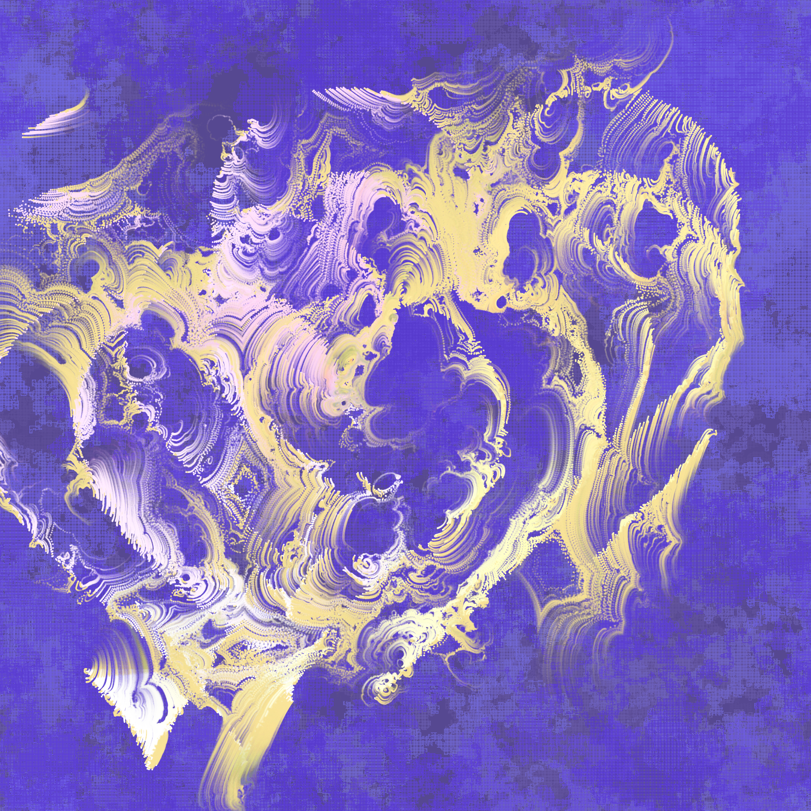

class: inverse, center, middle

# `R` and `RStudio`
## Week 1


```{r setup, include=FALSE}
options(htmltools.dir.version = FALSE)
```
```{r xaringan-themer, include=FALSE, warning=FALSE}
library(xaringanthemer)
style_solarized_light()
```

<style type="text/css">
.remark-slide-content {
    font-size: 30px;
    padding: 1em 4em 1em 4em;
}
</style>


---
class: inverse


.small[
### Learning objectives
+ **Define** the difference between `R` and `RStudio`
+ **Express** the benefits and issues associated with these software being used in the scientific community
+ **Distinguish** between different data types (e.g., integers, characters, logical, numerical)
+ **Explain** what an `R` function is; **describe** what an argument to an `R` function is
]

---
class: inverse


.small[
### Learning objectives
+ **Explain** what an `R` package is; **distinguish** between the functions `install.packages()` and `library()`
+ **Explain** what a *working directory* is in the context of `R`
+ **Interpret** and fix basic  `R` errors
+ **Use** the appropriate `R` function to read in a `.csv` data; **carry out** basic exploratory data analysis using `tidyverse` (use the pipe operator, `%>%` when summarising a `data.frame`); create simple plots of the data.
]

---
class: center, middle


The selling pitch of this course states that *...biological research has actually been heavily quantitative for 100+ years...* and promises that *...it is now essential for biology students to acquire skills in working with and visualising data, learning from data using models...*. We're not making it up! 

---

## Why `R`? 
### not an extensive list

--
+ Free

--
+ Open source

--
+ Huge online support network

--
+ Flexible; if you can code it you can do it!

--
+ Everybody's doing it...


---

## a`R`t

.pull-left[
```{r, eval = FALSE}
## devtools::install_github("djnavarro/turmite59")
turmite59::turmite59("blue")

```
]

.pull-right[

]

.footnote[[Artwork by @djnavarro](https://djnavarro.net/)]

---

## Why `RStudio`? 
### not an extensive list

--
+ Works nicely with `R`

--
+ Huge online support network

--
+ Flexible; so, so, many tools and additions!

--
+ Reproduciblity

---
class: inverse, center, middle


[Artwork by @allison_horst](https://github.com/allisonhorst/stats-illustrations)

---

## Terminology

--

+ **running** code: the act of telling R to perform an act by giving it commands in the console
--

+ **objects**: what values are stored in
--

+ **script**: a text file containing a set of commands and comments
--

+ **comments**: notes written within a **script** to better document/explain what's happening
--

---

## More terminology

--

+ **functions**: `R` commands that tell your computer what to do
--

+ **arguments**: inputs we give to **functions** that are used by that **function** to give some output
--

+ **packages**: a collection of specific **functions** 

---

## Errors

```{r error, error = TRUE}
library(tidy)
```

---

## Errors

```{r error2, error = TRUE}
lbrary(tidyverse)
```

---

## Errors

```{r error3, error = TRUE}
paua <- read_csv("paua.csv")
```

---

## Errors

```{r error4, error = TRUE, message = FALSE}
library(tidyverse)
paua <- read_csv("paua.csv")
```


---

```{r, echo = FALSE, include=FALSE}
library(flipbookr)
```

```{r example_read, include = FALSE}
library(tidyverse)
paua <- read_csv("../data/paua.csv")
glimpse(paua)
```


`r chunk_reveal(chunk_name = "example_read", title = "### Everything working nicely!")`

---
```{r example_mean, include = FALSE}
paua %>%
  group_by(Species) %>%
  summarise(av_length = mean(Length))
```


`r chunk_reveal(chunk_name = "example_mean", title = "### Everything working nicely!")`

---
```{r example_plot, include = FALSE}
library(ggplot2)
ggplot(data = paua,aes(x = Species, y = Length)) + 
  geom_boxplot()
  
```

`r chunk_reveal(chunk_name = "example_plot", title = "### Everything working nicely!")`


---

class: inverse, center, middle

# Data exploration and visualization
## Week 2

---
class: inverse


.small[
### Learning objectives
+ **Define** data sovereignty and **explain** this in relation to a researcher's obligation when collecting, displaying, and analysing data
+ **Define** and **discuss** Māori Data Sovereignty principles
+ **Carry out** and **interpret** the outputs of basic exploratory data analysis using in-built R functions
+ **Create** and **communicate** informative data visualisations using `R`
+ **Discuss** and **critique** data visualisations

]

---
### Data Sovereignty?

+ Data Sovereignty typically refers to the understanding that **data is subject to the laws of the nation within which it is stored**

+ Indigenous Data Sovereignty perceives **data as subject to the laws of the nation from which it is collected**

---

### What is Māori Data Sovereignty?

+ Māori Data Sovereignty recognises that **Māori data should be subject to Māori governance**

+ Māori Data Sovereignty **supports tribal sovereignty** and the **realisation of Māori and Iwi aspirations**


---

### Te Mana Raraunga

```{r, echo  = FALSE}
knitr::include_url("https://www.temanararaunga.maori.nz/", height = "400px")
```

---

### `tidy` data

 1. Each variable must have its **own column**
 2. Each observation must have its **own row**
 3. Each value must have its **own cell**


---
### Data manipulation

```{r penguins, results='hide'}
library(palmerpenguins) ## contains some nice penguin data
penguins %>% 
  apply(.,2,is.na) %>%
  apply(.,2,sum)
```


---
`r chunk_reveal(chunk_name = "penguins", title = "### Data manipulation")`

---
### Data manipulation

```{r penguins_na, results='hide'}
penguins_nafree <- penguins %>% drop_na()
penguins_nafree
```

---

`r chunk_reveal(chunk_name = "penguins_na", title = "### Data manipulation")`

---
### Data manipulation

```{r penguins_av,results='hide'}
penguins_nafree %>% 
  group_by(species) %>% 
  summarise(avgerage_bill_length = mean(bill_length_mm))
```

---

`r chunk_reveal(chunk_name = "penguins_av", title = "### Data manipulation")`

---
class: center, middle

## Data Viz

> "...have obligations in that we have a great deal of power over how people ultimately make use of data, both in the patterns they see and the conclusions they draw." `r tufte::quote_footer('--- Michael Correll, Ethical Dimensions of Visualization Research')`

---
### Exploratory plots

  + data **exploration**
  + doesn't have to look pretty
  + just needs to **get to the point**
  + **explore** and **discover** new data facets
  + formulate **new questions**
  
---
**[slido.com](slido.com) code #biosci220: what do you think of this plot?**

`r countdown::countdown(minutes = 2, seconds = 0, bottom = 0)`
  
```{r example, echo = FALSE, fig.cap="", warning = FALSE, message = FALSE}
ggplot(data = penguins_nafree, aes(x = bill_length_mm, y = bill_depth_mm, color = species)) +
  geom_point()
```

---

### Explanatory plots
#### most common kind of graph used in scientific publications

   + **clear** purpose
   + designed for the audience
   + make it **easy to read** (*this covers a lot of things*)
   + do not distort
   + guide the reader to a **particular conclusion**
   + answer a **specific question**
   + **support** a decision
   
---

.small[
> "Scientific visualization is classically defined as the process of graphically displaying scientific data ... There are so many different ways to represent the same data: scatter plots, linear plots, bar plots, and pie charts ... the same data, using the same type of plot, may be perceived very differently depending on who is looking at the figure." `r tufte::quote_footer('--- Nicolas P. Rougier, Michael Droettboom, Philip E. Bourne, Ten Simple Rules for Better Figures ')`
]

---

**[slido.com](slido.com) code #biosci220: what do you think of this plot?**

`r countdown::countdown(minutes = 2, seconds = 0, bottom = 0)`
  
```{r, echo = FALSE}
knitr::include_graphics("img/coxcomb.png")
```

.footnote[[Create this yourself](https://rpubs.com/kwlee58/492913)]
---

### [Ten Simple Rules for Better Figures](https://journals.plos.org/ploscompbiol/article?id=10.1371/journal.pcbi.1003833)

 + **Know** Your Audience
 
 + **Identify** Your Message
 
 + **Adapt** the Figure to the Support Medium
 
 + **Captions** Are Not Optional
 
 + **Do Not** Trust the Defaults
 
---

### [Ten Simple Rules for Better Figures](https://journals.plos.org/ploscompbiol/article?id=10.1371/journal.pcbi.1003833)

 + Use **Color** Effectively
 
 + **Do Not Mislead** the Reader
    
 + **Avoid** *Chartjunk*
 
 + **Message** Trumps Beauty

 + Get the Right **Tool**


---
### Introducing `ggplot2`

Every `ggplot2` plot has three key components:

  + `data`,

  + A set of `aes`thetic mappings between variables in the data and visual properties, and

  + At least one layer which describes how to render each observation. Layers are usually created with a `geom` function.

---

###  `ggplot2`


---

```{r bar, fig.show='hide'}
ggplot(penguins_nafree, aes(x = species, fill = sex)) +
  geom_bar(alpha = 0.8, position = "dodge") +
  facet_wrap(~island) +
  xlab("") +
  theme_linedraw() + 
  scale_fill_manual(values = c("cyan4","darkorange"), name = "Sex") 
```

---

`r chunk_reveal(chunk_name = "bar", title = "")`

---


```{r point, fig.show='hide'}
ggplot(data = penguins_nafree, aes(x = bill_length_mm, y = bill_depth_mm)) +
  geom_point(aes(color = species),size = 2)  +
  scale_color_manual(values = c("darkorange","darkorchid","cyan4"), name = "") +
  theme_bw() + ## Oo a new theme
  xlab("Bill length (mm)") +
  ylab("Bill length (mm)")
```

---

`r chunk_reveal(chunk_name = "point", title = "")`

---
class: center, middle

### **[slido.com](slido.com) code #biosci220: what does a plot tell us about our data?**

`r countdown::countdown(minutes = 2, seconds = 0, bottom = 0)`

---
#### Between group variation

```{r, echo = FALSE}
means <- penguins_nafree %>% group_by(species) %>% summarise(means = mean(bill_length_mm))
mean <- mean(penguins_nafree$bill_length_mm)
means$ends <- mean
means$lag1 <- means$means[c(2,3,1)]
means$lag2 <- means$means[c(3,1,2)]
ggplot(penguins_nafree,aes(x = species, y = bill_length_mm)) + 
    geom_violin()  + 
  ylab("Bill length (mm)") +
  xlab("Species") +
  geom_point(data = means, aes(x = species, y = means),color = "blue", size = 2) +
  annotate(geom = 'text', label = "Average bill length per species" , x = -Inf, y = Inf, hjust = 0, vjust = 1.2, color = "blue") +
  geom_hline(yintercept = mean, color = "red") +
  annotate(geom = 'text', label = "Overall average bill length" , x = -Inf, y = Inf, hjust = 0, vjust = 3, color = "red") +
  geom_segment(data = means, aes(x = species, y = means, xend = species, yend = ends),col = "darkgreen", size = 2)  +
  annotate(geom = 'text', label = "Differences to overall average" , x = -Inf, y = Inf, hjust = 0, vjust = 5, color = "darkgreen") +
  geom_hline(data = means, aes(yintercept = means), color = "blue", alpha = 0.3, lty = 2) + 
  geom_segment(data = means, aes(x = as.numeric(species) - 0.15, y = means, 
                                 xend = as.numeric(species) - 0.15, yend = lag1),col = "purple", size = 2) +
  geom_segment(data = means, aes(x = as.numeric(species) + 0.15, y = means, 
                                 xend = as.numeric(species) + 0.15, yend = lag2),col = "purple", size = 2)+
  annotate(geom = 'text', label = "Differences between groups" , x = -Inf, y = Inf, 
           hjust = 0, vjust = 7, color = "purple")
```

---

#### Within group variation

```{r,echo = FALSE}
jit <- ggplot() + 
  geom_jitter(data = penguins_nafree,aes(x = species, y = bill_length_mm, color = species), alpha = 0.2) 

penguins_nafree$x_points <- layer_data(jit)$x
penguins_nafree$y_points <- layer_data(jit)$y
penguins_nafree <- penguins_nafree %>% group_by(species) %>% mutate(sp_means = mean(bill_length_mm))

ggplot() + 
  ylab("Bill length (mm)") +
  xlab("Species") +
  geom_point(data = means, aes(x = species, y = means, color = species), size = 2) +
  geom_text(data = means, aes(x = species, y = means + 2.5, color = species, 
                              label = paste0("Species average = ",round(means,3)))) +
  geom_hline(data = means, aes(yintercept = means, color = species), alpha = 0.3, lty = 2) +
  geom_point(data = penguins_nafree,aes(x = x_points, y = y_points, color = species), alpha = 0.2) +
  theme(legend.position = "none") + 
  geom_segment(data = penguins_nafree, aes(x = x_points, y = y_points, xend = x_points, 
                                 yend = sp_means,color = species), size = 1, alpha = 0.2) 
```

